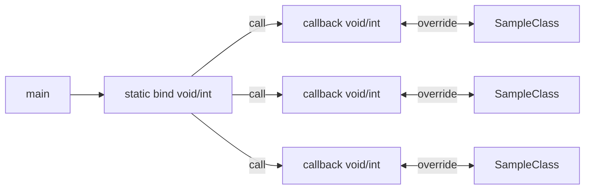
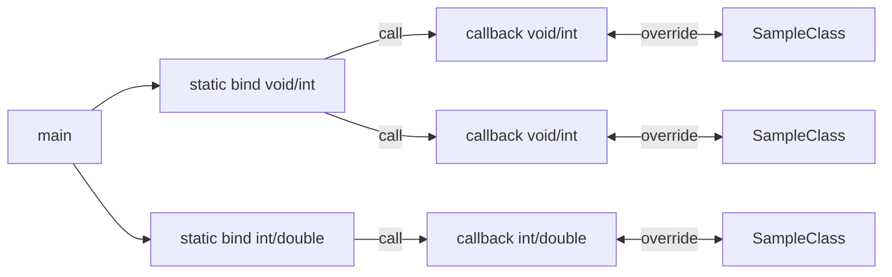

# FUnctionBinder

メンバ関数をスタックし、静的関数として呼べるようにする

# Usage

メンバ関数 `R callback(Args...)` をオーバーロードすることで、メンバ静的関数 `static R bind(Args...)` にまとめることができます。



テンプレート、static の仕様上、テンプレートパラメーターが異なる `FunctionBinder` クラスは別々のリストで管理されます。



## API

-   template parameter

    `FunctionBinder<R(Args...)>`

    `@param R` 仮想関数、バインド関数の戻り値を設定します。どの仮想関数の戻り値を返却するか判別できないため、空要素を返します。

    `@param Args...` 仮想関数、バインド関数の引数を設定します

-   `R callback(Args...)`

    コールする仮想関数

-   `static R bind(Args...)`

    オーバーライドされたすべての `R callback(Args...)` を呼ぶ

## Basic

-   basic

    ```cpp
    #include <iostream>
    #include "FunctionBinder.h"

    class Sample : public FunctionBinder<void(int)>
    {
    	void callback(int arg) override {
    		std::cout << arg << std::endl;
    	}
    };

    int main() {
    	Sample samp0;
    	Sample samp1;
    	Sample samp2;
    	FunctionBinder<void(int)>::bind(100);
    	/*
    		100
    		100
    		100
    	*/
    }
    ```

-   Arduino

    C++標準ライブラリを使用していないので Arudino 系でも使用できます

    ```cpp
    class Reader : FunctionBinder<void(int)>
    {
    	Reader() {
    		Wire.onReceive(FunctionBinder<void(int)>::bind);
    	}
    	void callback(int) override {
    		Serial.println("received");
    	}
    }

    Reader reader;

    void setup() {
    	Serial.begin(115200);
    	Wire.begin(0);
    }
    void loop() {
    	/*
    		受信割り込みのためloop内は空
    		received
    		received
    		received
    		received
    	*/
    }
    ```

    ```cpp
    #include <iostream>
    #include "FunctionBinder.h"

    class Sample : public FunctionBinder<void(int)>
    {
    	void callback(int arg) override {
    		std::cout << arg << std::endl;
    	}
    };

    int main() {
    	Sample samp0;
    	Sample samp1;
    	Sample samp2;
    	FunctionBinder<void(int)>::bind(100);
    	/*
    		100
    		100
    		100
    	*/
    }
    ```

-   １クラスに複数コールバック関数を設定する

    ```cpp
    class Sample : public FunctionBinder<void(int)>, public FunctionBinder<void(int, int)>
    {
    	void FunctionBinder<void(int)>::callback(int arg) override {
    		std::cout << arg << std::endl;
    	}
    	void FunctionBinder<void(int, int)>::callback(int arg1, int arg2) override {
    		std::cout << arg1 << '\t' << arg2 << std::endl;
    	}
    };

    int main() {
    	Sample samp0;
    	Sample samp1;
    	Sample samp2;
    	FunctionBinder<void(int)>::bind(100);
    	FunctionBinder<void(int, int)>::bind(10, 20);
    	/*
    		100
    		100
    		100
    		10      20
    		10      20
    		10      20
    	*/
    }
    ```
