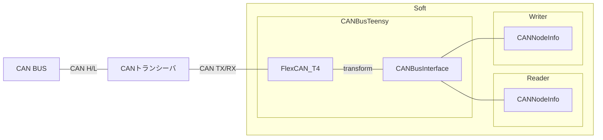
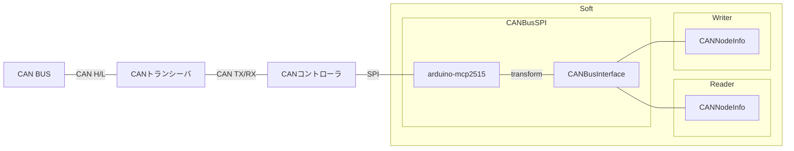

# CAN Bus

バス管理クラス

バス管理クラスのみではデータの読み取り、書き込みはできません。

`CANNodeInfo` 構造体と組み合わせて、通信データの読み取り書き込みを行います。

---

## CANNodeInfo

各ノードを管理する構造体です。以下のメンバを持ちます。

```cpp
uint32_t id
uint8_t* buffer
size_t   length
uint32_t timestampUs
```

---

## CANBusInterface

バス管理クラスは全てこのクラスを継承し、仮想関数をオーバーライドします。

使用するマイコンによってバス管理クラス(型)が切り替わっても、このクラスが基底クラスであるため、型を変えずにバスオブジェクトを保持することができます。そのため、マイコンが異なっていても、同じコードで `CANNodeInfo` のラッパークラス等を作成することができます。

-   API

    ノードをバスに参加させる。

    -   `virtual joinTX(CANNodeInfo& node)`
    -   `virtual joinRX(CANNodeInfo& node)`

    ノードをバスから切り離す。

    -   `virtual detachTX(CANNodeInfo& node)`
    -   `virtual detachRX(CANNodeInfo& node)`

-   Sample

    ```cpp
    uint8_t buffer[10];
    CANNodeInfo node {
        /*uint32_t id         */ 0            ,
        /*uint8_t* buffer     */ buffer       ,
        /*size_t   length     */ sizeof buffer,
        /*uint32_t timestampUs*/ 0            ,
    };

    CANBus---- bus;

    void setup() {
        bus.joinTX(node);
    }
    void loop() {}
    ```

---

## CANBusTeensy

teensy 内臓 CAN コントローラーを使用して CAN 通信を行うバスクラス



-   依存ライブラリ

    [FlexCAN_T4](https://github.com/tonton81/FlexCAN_T4)

    [IntervalTimer](https://github.com/loglow/IntervalTimer)

-   API

    コンストラクタ

    -   `template<CAN_DEV_TABLE Bus> CANBusTeensy::CANBusTeensy()`

        `@tparam {Bus}` バス種類 (CAN0,CAN1,CAN2,CAN3) [ライブラリドキュメント](https://github.com/tonton81/FlexCAN_T4) 参照

    通信開始

    -   `void CANBusTeensy::begin(uint32_t baudrate = 1000000)`

        `@param {baudrate}` CAN 通信レート

    通信更新

    -   `void CANBusTeensy::update(uint32_t writeIntervalUs = 5000)`

        `@param {writeIntervalUs}` 送信間隔

        バスに大量のデータが流れないよう、ループ周期に関係なく設定間隔以下で送信されないようになっています。

-   Sample

    ノード ID0 が送信しているデータを取得する。

    ```cpp
    uint8_t buffer[10];
    CANNodeInfo node {
        /*uint32_t id         */ 0            ,
        /*uint8_t* buffer     */ buffer       ,
        /*size_t   length     */ sizeof buffer,
        /*uint32_t timestampUs*/ 0            ,
    };

    CANBusTeensy<CAN1> bus;
    void setup()
    {
        bus.joinRX(node);  // ノードをバスに参加させる(複数参加させることもできます)
        bus.begin();       // 通信開始
        Serial.begin(115200);
    }

    void loop()
    {
        bus.update();
        for(size_t i = 0; i < node.length; ++i)
        {
            Serial.print(node.buffer[i]);
        }
        Serial.println();
    }
    ```

    生で `CANNodeInfo` を使うと上のように少し複雑になります。そのため `CANNodeInfo` のラッパークラスである、`CANReader`, `CANWriter` クラス等を使います。

---

## CANBusSpi

外付け CAN コントローラーを使用して CAN 通信を行うバスクラス



-   依存ライブラリ

    [arduino-mcp2515](https://github.com/autowp/arduino-mcp2515)

-   API

    コンストラクタ

    -   `template<uint8_t CS, uint8_t Interrupt> CANBusSpi::CANBusSpi(SPIClass& spi, uint32_t spiClock = 10000000)`

        `@tparam {CS}` SPI chip select ピン

        `@tparam {Interrupt}` CAN コントローラー Int 端子接続ピン

        `@param {spi}` SPI クラスインスタンス

        `@param {spiClock}` SPI クロック

    通信開始

    -   `void CANBusSpi::begin(CAN_CLOCK CANClock = MCP_20MHZ, CAN_SPEED baudrate = CAN_1000KBPS)`

        `@param {baudrate}` CAN 通信レート [ライブラリドキュメント](https://github.com/autowp/arduino-mcp2515) 参照

        `@param {CANClock}` CAN コントローラー動作周波数 [ライブラリドキュメント](https://github.com/autowp/arduino-mcp2515) 参照

    通信更新

    -   `void CANBusTeensy::update(uint32_t writeIntervalUs = 5000)`

        `@param {writeIntervalUs}` 送信間隔

        バスに大量のデータが流れないよう、ループ周期に関係なく設定間隔以下で送信されないようになっています。

-   Sample

    ```cpp
    CANBusSpi<9, 2> bus(SPI);
    void setup() {
        bus.begin();
    }
    void loop() {
        bus.update();
    }
    ```
