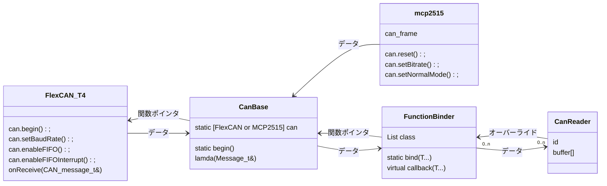

# CanReader

## Description

CAN 通信受信クラス

-   対応マイコン

    teensy.3X, teensy4X, arduino

-   制限

> インスタンス(ID) : 11bit 分まで
>
> 各インスタンス : 255byte まで
>
> バス : 約 500byte まで

## Data

-   `@date` 2022/09/27
-   `@author` 大河 祐介

# Usage

`CanBase.h` `FunctionBinder.h` を `CanReader.h` と同ディレクトリ上に配置する必要があります

外部ライブラリを使用しています

> teensy : [FlexCAN_T4](https://github.com/tonton81/FlexCAN_T4) [IntervalTimer](https://github.com/loglow/IntervalTimer)
>
> arduino : [mcp2515](https://github.com/autowp/arduino-mcp2515)

受信は割り込みによって行われます

> teensy : タイマー割り込み
>
> arduino : 外部割り込み

## API

-   コンストラクタ

    -   `template<uint8_t Size>CanReader(id)`

        通信開始

        `@param Size` 受信サイズ

        `@param id` 監視するデータ ID

-   通信監視(WDT)

    -   `operator bool`

        `@return` 通信しているか(最後の受信から 30ms 未満)

-   受信データ取得

    -   `const uint8_t& operator[]`

-   デバッグ出力

    -   `show(end = {})`

        `@param end` 最後に出力される文字

-   その他

    -   `uint8_t size`

        `@return` 設定受信サイズ

# Example

```cpp
#include "CanReader.h"

CanReader<6> reader1(1);
CanReader<6> reader2(2);

void setup() {
	Serial.begin(115200);
}

void loop() {
	reader1.show();
	reader2.show('\n');
	delay(10);
}
```

# 内部構造

## 通信フォーマット

> [ id ] + [ index + data×7byte ]
>
> 送信量が 7byte を超える場合はパケットに分けて送信する

## クラス



-   `CanBase`

    > `static void begin()`
    >
    > 通信開始(既に開始されている場合は開始しない)
    >
    > `static void write(void (*callback)(Message_t&, void*), void* _this)`
    >
    > データセット

    teensy, arduino で使用するライブラリが違うので、差異を吸収する

    ライブラリの切り替えはプリプロセッサによって行う

    CAN 通信に使用するクラスのインスタンスは 1 つでなくてはならいので、インスタンスを 静的メンバで管理し、Reader, Writer に派生させる構造になっている

-   `FunctionBinder`

    > コンストラクタ(this ポインタを単方向リストに追加)
    >
    > `FunctionBinder()`
    >
    > コールされる純粋仮想関数
    >
    > `virtual void callback(PTy...) = 0`
    >
    > 全てのインスタンスの仮想関数を呼ぶ静的関数
    >
    > `static void bind(PTy... param)`

    自身の this ポインタをリストに保存し、 `bind` が呼ばれたときに、全ての仮想関数をコールするクラス

    高階関数の引数は関数ポインタ(静的関数用)なのでメンバ関数は登録できない。そのためこのクラスでは仮想関数をオーバーライドし静的関数にまとめる構造になっている

    また引数は可変長引数テンプレートクラスであるため引数がある関数もコールバックできる
