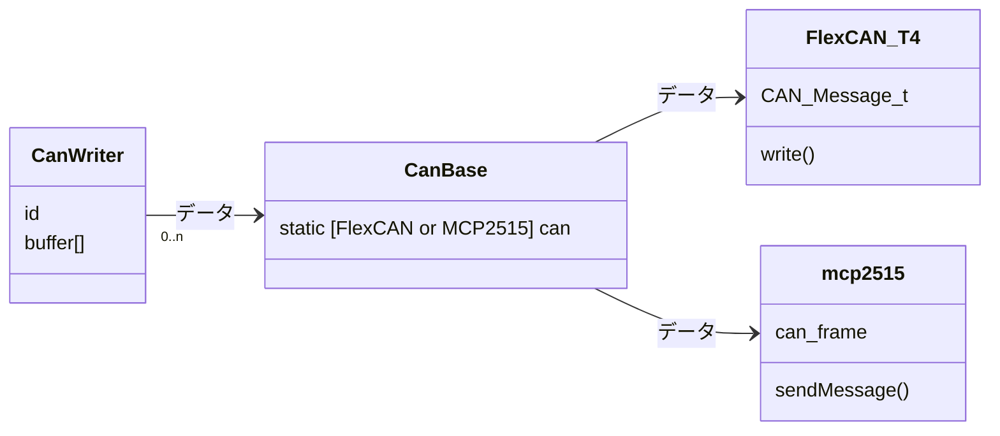

# CanWriter

## Description

CAN 通信送信クラス

-   対応マイコン

    teensy.3X, teensy4X, arduino

-   制限

> インスタンス(ID) : 11bit 分まで
>
> 各インスタンス : 255byte まで
>
> バス : 約 500byte まで

## Data

-   `@date` 2022/09/27
-   `@author` 大河 祐介

# Usage

外部ライブラリを使用しています

> teensy : [FlexCAN_T4](https://github.com/tonton81/FlexCAN_T4) [IntervalTimer](https://github.com/loglow/IntervalTimer)
>
> arduino : [mcp2515](https://github.com/autowp/arduino-mcp2515)

受信は割り込みによって行われます

> teensy : タイマー割り込み
>
> arduino : 外部割り込み

## API

-   コンストラクタ

    -   `template<uint8_t Size>CanReader(id)`

        通信開始

        `@param Size` 送信サイズ

        `@param id` データ ID

-   送信データセット

    -   `uint8_t& operator[]`

-   デバッグ出力

    -   `show(end = {})`

        `@param end` 最後に出力される文字

-   その他

    -   `uint8_t size`

        `@return` 設定送信サイズ

# Example

```cpp
#include "CanWriter.h"

CanWriter<6> writer1(1);
CanWriter<6> writer2(2);

void setup() {
}

void loop() {
	writer1[0] = millis();
	writer2[0] = millis() / 10;
	writer1.update();
	writer2.update();
	delay(10);
}
```

# 内部構造

## 通信フォーマット

> [ id ] + [ index + data×7byte ]
>
> 送信量が 7byte を超える場合はパケットに分けて送信する

## クラス



-   `CanBase`

    > `static void begin()`
    >
    > 通信開始(既に開始されている場合は開始しない)
    >
    > `static void write(void (*callback)(Message_t&, void*), void* _this)`
    >
    > データセット

    teensy, arduino で使用するライブラリが違うので、差異を吸収する

    ライブラリの切り替えはプリプロセッサによって行う

    CAN 通信に使用するクラスのインスタンスは 1 つでなくてはならいので、インスタンスを 静的メンバで管理し、Reader, Writer に派生させる構造になっている
