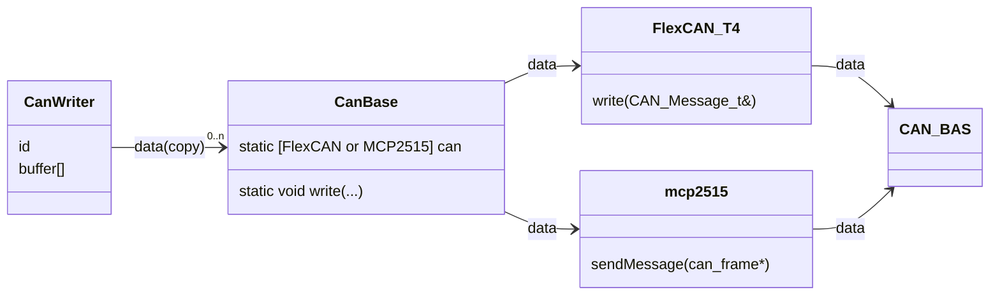

# CanWriter

## Description

CAN 通信送信クラス publisher

-   対応マイコン

    > teensy3x
    >
    > teensy4x
    >
    > arduino(予定)

-   制限

    > インスタンス(ID) : ~2048 (11bit 分)
    >
    > 各インスタンス : ~255byte (8bit 分)

## Data

-   `@date` 2022/10/29
-   `@author` 大河 祐介

# Usage

`CanBase.h` を `CanWriter.h` と同ディレクトリ上に配置する必要があります

外部ライブラリを使用しています (Github)

> teensy : [FlexCAN_T4](https://github.com/tonton81/FlexCAN_T4) [IntervalTimer](https://github.com/loglow/IntervalTimer)
>
> arduino : [mcp2515](https://github.com/autowp/arduino-mcp2515)

受信は割り込みによって行われます

> teensy : タイマー割り込み
>
> arduino : 外部割り込み

## API

-   コンストラクタ

    -   `template<uint8_t Size> CanReader(id)`

        通信開始

        `@param Size` 送信サイズ

        `@param id` データ ID

-   データセット

    -   `uint8_t& operator[]`

-   送信

    -   `update()`

-   デバッグ出力

    -   `show(end = {})`

        `@param end` 最後に出力される文字

-   その他

    -   `uint8_t size()`

        `@return` 設定送信サイズ

# Example

```cpp
#include "CanWriter.h"

CanWriter<6> writer1(1);
CanWriter<6> writer2(2);

void setup() {
}

void loop() {
	writer1[0] = millis();
	writer2[0] = millis() / 10;
	writer1.update();
	writer2.update();
	delay(10);
}
```

# Structure

## format

> 7byte を超えるデータはパケット分割し通信されます
>
> [ id (11bit) ] + [ index (1byte) + data (7byte) ]
>
> index : パケットの識別子

## data flow

> 送信データは `CanBase` クラスの `Message_t` 構造体によって各ライブラリへ転送されます
>
> ```cpp
> struct Message_t {
>   uint32_t& id   ;  /// data id
>   uint8_t&  index;  /// packet index
>   uint8_t*  data ;  /// message array[7]
> };
> ```
>
> またデータはポインタ、参照で転送するので処理が軽量です (CanReader バッファへのデータ転送はコピーです)
>
> ポインタ、参照は各ライブラリの各構造体インスタンスメンバを指しています



-   `CanBase`

    > `static void begin()`
    >
    > 通信開始(既に開始されている場合は開始しない)
    >
    > `static void write(void (*callback)(Message_t&, void*), void* _this)`
    >
    > データセット

    > teensy, arduino で使用するライブラリが違うので、差異を吸収する
    >
    > ライブラリの切り替えはプリプロセッサによって行う
    >
    > CAN 通信に使用するインスタンスは 1 つでなくてはならいので、インスタンスを 静的メンバで管理し、Reader, Writer に派生させる

# Benchmark

## 処理速度

-   255byte 送信時 (teensy4.0)

    約 44μs
