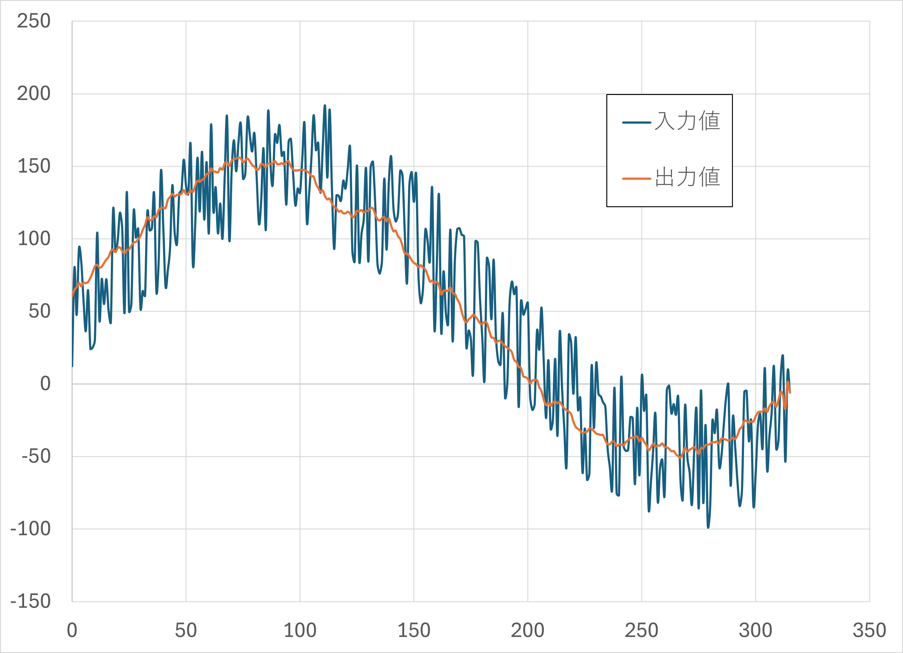

# 移動平均

モータの出力値を急激に変化させると、大電流が流れモーターやモータードライバーに負荷がかかります。この出力値の急激な変化を抑えるのに移動平均を利用します。

移動平均とは時系列データを平滑化する手法で、ここではサンプル数回の入力値の平均を求めます。そのため、目標とする

```cpp
#include <Udon.hpp>

static Udon::LoopCycleController loopCtrl{ 10000 };
static Udon::MovingAverage<50> movingAverage;  // サンプル数 50

void setup()
{
}

void loop()
{
    movingAverage.update(入力値);
    double 出力値 = movingAverage.getValue();

    loopCtrl.update();
}
```

移動平均クラスは以下の様に、元の出力値の急激な変化を軽減します。

