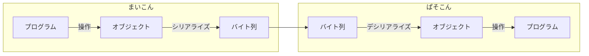

# シリアライズ デシリアライズ

## Description

オブジェクトのバイト列化、またその逆を行います。

マイコン、PC同士の通信ではバイト列を用いて通信するため、オブジェクトを直接送受信することはできません。

そこでオブジェクトをシリアライズして送信し、受信したデータをデシリアライズすることでオブジェクトの受け渡しが可能になります。



## Usage

オブジェクトをシリアル化(バイト列化)するには次のように記述します。

シリアル化したいオブジェクトのデータ構造を構造体、クラスを用いて定義します。`UDON_PARSABLE` マクロにメンバを登録することでシリアル化可能となります。 `Udon::Pack()` の引数にオブジェクトを渡すことでバイト列が `std::vector<uint8_t>` として返されます。

```cpp
struct Vec2
{
    double x;
    double y;
    UDON_PARSABLE(x, y);
};
```

```cpp
Vec2 v{ 2.5, 3.4 };
const auto packed = Udon::Pack(v);
```

バイト列をオブジェクトに復元するには`Udon::Unpack()`を使用し次のように記述します。 `Udon::Unpack` は`Udon::Optional<Vec2>`型のオブジェクトを返します。

`Optional<T>` 型は値(T)を持つか持たないかを表す型です。`Optional`が返ることでデシリアライズできたかどうかの判定ができます。`Optional` は `operator bool()` メンバを持っているため、次のようにif 文で判定可能です。

```cpp
if (const auto unpacked = Udon::Unpack<Vec2>(packed))
{
    Serial.print(unpacked->x);  Serial.print('\t');
    Serial.print(unpacked->y);  Serial.print('\n');
}
else
{
    Serial.println("Unpack failed!");  // データ破損
}
```

## Specification

- 動作仕様

  浮動小数点型はすべて `Udon::Float32_t` にキャストされシリアライズされます。

  bool 型メンバ変数は 8 個で 1byte にシリアライズされます。

  エンディアン変換を自動で行います。

  バイト列末端に 1byte CRC8 チェックサムが挿入されます。

- `Udon::Pack`

    オブジェクトをシリアライズします

    Pack関数は次のオーバーロードが定義されています。

    ```cpp
    std::vector<uint8_t> Pack(const T& object)

    bool Pack(const T& object, uint8_t* buffer, size_t size)

    bool Pack(const T& object, uint8_t (&array)[N])
    ```

- `Udon::Unpack<T>`

    バイト列をオブジェクトにデシリアライズします

    Unpack関数は次のオーバーロードが定義されています。

    ```cpp
    template <typename T>
    Udon::Optional<T> Unpack(const std::vector<uint8_t>& buffer)

    template <typename T>
    Udon::Optional<T> Unpack(const uint8_t* buffer, size_t size)

    template <typename T>
    Udon::Optional<T> Unpack(const uint8_t (&array)[N])
    ```

- `Udon::CanUnpack<T>`

    デシリアライズできるかを確認します。

    ```cpp
    template <typename T>
    bool CanUnpack(const std::vector<uint8_t>& buffer)

    template <typename T>
    bool CanUnpack(const uint8_t* buffer, size_t size)

    template <typename T>
    bool CanUnpack(const uint8_t (&array)[N])
    ```

## Details

- `UDON_PARSABLE`

    `UDON_PARSABLE` はシリアライザがメンバ変数を解析できるようにするためのマクロです。次のように展開されます。

    ```cpp
    struct Vec2
    {
        double x;
        double y;

        using IsParsable_tag = void;

        constexpr size_t capacity() const
        {
            return Udon::Capacity(x, y);
        }

        template <typename Acc>
        void accessor(Acc& acc)
        {
            acc(x, y);
        };
    };
    ```

  - `IsParsable_tag`
  
    > `IsParsable_tag` は型が解析可能かを区別する際に使用します。
    >
    > `Udon::IsParsable<T>` を使用し、型(ここではVec2)を解析できるかできないかコンパイル時に判定できるため、`static_assert`によってユーザーに分かりやすくエラーを出すことができます。
    >
    > ```cpp
    > static_assert(Udon::IsParsable<Vec2>::value, "can not serialize");
    > ```

  - `capacity()`
  
    > `capacity()` はシリアライズ後のバイト列のバイトサイズを求める `CapacityWithChecksum` から呼び出されます。
    >
    > コンパイル時にサイズが決定するためバッファの大きさを指定するときなどにも使えます。
    >
    > ```cpp
    > uint8_t buffer[Udon::CapacityWithChecksum<Vec2>()];
    > ```

  - `accessor()`
  
    > `accessor()` は解析用クラス(ここではUdon::Serializer)が呼び出すことでメンバ変数を解析するときに使用します。
    >
    > テンプレートパラメータ`Acc` には解析用クラスの型が入ります。
    >
    > acc(x, y) とすることで `Udon::Serializer` クラスの可変長`operator()(...)` が呼ばれ、スカラ型(int, double等)になるまで再帰的に`operator()()` を呼び出します。呼び出すときに各スカラオブジェクトのシリアル化を行い、`Udon::Serializer` 内部のバッファに挿入していくことでシリアライズを行います。

- シリアライズ処理順序

  1. `Udon::Pack` 関数がユーザーに呼び出される

  2. `Udon::Serializer` クラスのオブジェクトが生成される

  3. `accessor()` を使用してメンバを解析、シリアル化、バッファへ挿入

  4. バッファを基にチェックサムを求めバッファの末端に挿入

  5. シリアル化したデータを`Udon::Pack`が返す

- デシリアライズ処理順序

  1. `Udon::Unpack<T>` 関数がユーザーに呼び出される

  2. 復元したデータを入れるT型オブジェクトが作成される

  3. `Udon::Deserializer` クラスのオブジェクトが生成される

  4. チェックサムの整合性チェック -> エラーであれば `Udon::Unpack` が `Udon::nullopt` を返し失敗

  5. `accessor()` を使用してメンバを解析、逆シリアル化、T型オブジェクトへ代入

  6. バッファを基にチェックサムを求めバッファの末端に挿入

  7. シリアル化したデータを`Udon::Unpack`が返す
