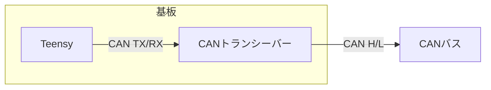
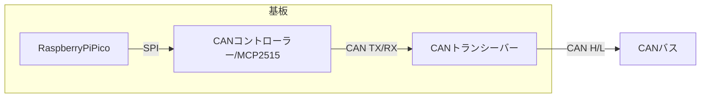

# CAN 通信

CAN 通信は自動車内部の通信等工業系で主に用いられる通信手法です。差動通信であるためノイズ耐性が高く、またバス型方式をとっているため容易に配線が可能です。

送信者は送信ノードと呼ばれ、各送信ノードは自由なタイミングで送信を行えます。他の送信ノードが送信中の場合、調停を行い送信タイミングを自動的に調整します。受信者は受信ノードと呼ばれ、送信者が持つ識別子を識別し受信を行います。

CAN 通信クラスは、通信バスクラス、送受信ノードクラスから構成され、組み合わせて使用します。

- [通信バスクラス](#通信バスクラス)
  - [Teensy](#teensy)
  - [Raspberry Pi Pico](#raspberry-pi-pico)
- [送信クラス](#送信クラス)
- [受信クラス](#受信クラス)
- [デバッグ](#デバッグ)
- [クラスの組み合わせ色々](#クラスの組み合わせ色々)

## 個別インクルード

```cpp
#include <Udon/Com/Can.hpp>
```

## 通信バスクラス

送受信処理、通信が行えているかどうかのチェックを行います。使用するマイコンや CAN コントローラーによって適切なバスクラスを選択します。

> CAN の通信プロトコルは CAN2.0B を使用します。ID は 0x000~0x7FF の範囲で使用できます。
>
> CAN2.0B は 一度に 8byte のデータしか送信できません。よって 8byte より多いデータは分割し送受信します。この時、1byte 目にはインデックス番号が付与されます。
>
> 8byte 以下のデータはインデックスを付与せず送受信するため、他の CAN デバイス (市販モーター等) との通信にも使用できます。

### Teensy

内臓 CAN コントローラーを使用し CAN 通信を行います。受信ノードが 8 個以内の場合、受信フィルタの設定を行います。



```cpp
static Udon::CanBusTeensy<CAN1> bus;
```

<details>
<summary> 詳細な設定について </summary>

`Udon::CanBusTeensy::Config` 構造体を用いて詳細な設定が可能です。構造体は次のように定義されています。

```cpp
struct Config
{
    uint32_t transmitInterval = 5;            // 送信間隔 [ms]
    uint32_t transmitTimeout  = 100;          // 送信タイムアウト時間 [ms]
    uint32_t receiveTimeout   = 100;          // 受信タイムアウト時間 [ms]
    uint32_t canBaudrate      = 1'000'000;    // CAN通信速度 [bps]
};
```

```cpp
static Udon::CanBusTeensy<CAN1> bus({
    .transmitInterval = 5,
    .transmitTimeout  = 100,
    .receiveTimeout   = 100,
    .canBaudrate      = 1'000'000,
});
```

</details>

### Raspberry Pi Pico

外部 CAN コントローラーを使用し CAN 通信を行います。コントローラーとは SPI で通信します。受信ノードが 6 個以内の場合、受信フィルタの設定を行います。受信フィルタが有効の場合、指定していない ID からの受信を関知しないため、不要な処理の削減につながります。



```cpp
static Udon::CanBusSpi bus({
    .interrupt = 2
});
```

<details>
<summary> 詳細な設定について </summary>

ピン設定等は設定値を格納するための構造体 `Udon::CanBusSpi::Config` を用いて設定します。これらの構造体は次のように定義されています。

```cpp
struct Config
{
    // SPI 関連
    spi_inst_t* channel = spi_default;                 // SPI チャンネル (spi0, spi1)
    uint8_t     cs      = PICO_DEFAULT_SPI_CSN_PIN;    // チップセレクトピン
    uint8_t     interrupt;                             // 受信割り込みピン
    uint8_t     mosi     = PICO_DEFAULT_SPI_TX_PIN;    // MOSIピン (TX)
    uint8_t     miso     = PICO_DEFAULT_SPI_RX_PIN;    // MISOピン (RX)
    uint8_t     sck      = PICO_DEFAULT_SPI_SCK_PIN;   // クロックピン
    uint32_t    spiClock = 1'000'000;                  // SPIクロック周波数 [Hz]

    // CAN 関連
    uint32_t  transmitInterval = 5;               // 送信間隔 [ms]
    uint32_t  transmitTimeout  = 100;             // 送信タイムアウト時間 [ms]
    uint32_t  receiveTimeout   = 100;             // 受信タイムアウト時間 [ms]
    CAN_SPEED canBaudrate      = CAN_1000KBPS;    // CAN通信速度
    CAN_CLOCK mcpClock         = MCP_16MHZ;       // トランシーバー動作クロック周波数 [Hz]
};
```

C99 対応コンパイラでは、構造体の初期化時に、メンバ変数名を指定することができます。メンバ変数を指定することで、インスタンス化部分を見たときに、引数の値が何の意味を持つかパット見で分かります。

```cpp
static Udon::CanBusSpi bus{ spi0, 0, 1, 2, 3, 4 };  // 各値の意味がコンストラクタの実装を見ないと分からない
↓
static Udon::CanBusSpi bus({
    .channel   = spi0,
    .cs        = 0,
    .interrupt = 1,
    .mosi      = 2,
    .miso      = 3,
    .sck       = 4
});
```

</details>

## 送信クラス

`Udon::CanWriter<T>`

`T` に指定された型のオブジェクトをバスへ送信します。

```cpp
static Udon::CanBusTeensy<CAN1> bus;
static Udon::CanWriter<Udon::Vec2> writer{ bus, 0x010 };  // Udon::Vec2 をノードID 0x010 として送信

void setup()
{
    bus.begin();
}

void loop()
{
    bus.update();

    Udon::Vec2 vector{ 100.0, 200.0 };    // 送信するオブジェクトをインスタンス化
    writer.setMessage(vector);            // オブジェクトを登録

    delay(10);
}
```

## 受信クラス

`Udon::CanReader<T>`

`T` に指定された型のオブジェクトをバスから取得します。送信クラスの `T` と同じ型である必要があります。

```cpp
static Udon::CanBusTeensy<CAN1> bus;
static Udon::CanReader<Udon::Vec2> reader{ bus, 0x010 };  // ノードID 0x010 から Udon::Vec2を受信

void setup()
{
    bus.begin();
}
void loop()
{
    bus.update();

    if (const Udon::Optional<Udon::Vec2> vector = reader.getMessage())  // データ取得
    {
        // 受信成功
        Serial.print(vector->x); Serial.print('\t');
        Serial.println(vector->y);
    }
    else
    {
        // 受信失敗(データ破損検出、通信タイムアウト等)
        Serial.println("receive failed!!");
    }

    delay(10);
}
```

> `getMessage` は正常にオブジェクトが受信できたかどうか判定できるように `Udon::Optional<T>` を返します。通信エラー時は `Udon::nullopt` が返されます。
> `Udon::Optional` は値と値が有効であるかを持つクラスで、 `operator bool` によって値を保持するか取得できます。if 文で正常に受信できたかどうかで分岐できます。
>
> `Udon::Optional<T>::operator->` で保持しているオブジェクトのメンバへアクセスでき、`Udon::Optional<T>::operator*` で optional が持っているオブジェクトの参照を取得できます。

## バイト列を直接送受信

ロボマスモーター等の CAN 通信を用いる市販のモーターをドライブするには、バイト列で直接やり取りする必要があります。この場合、チェックサムを付与する `CanReader` `CanWriter` クラスは使用できません。バイト列を直接やり取りするには送受信ノードを `createTx` `createRx` 関数を用いて作成し、作成したノードに対しデータの書き込み、読み出しを行います。

### 送信ノード

```cpp
struct CanTxNode
{
    uint32_t id;                  // メッセージ ID (バスが書き込み、ユーザーが読み取り)

    std::vector<uint8_t> data;    // 送信データ (ユーザーが書き込み、バスが読み取り)

    uint32_t transmitMs;          // 最終通信時刻 (バスが書き込み、ユーザーが読み取り)
};
```

```cpp
static Udon::CanBusxxxx bus;

static Udon::CanTxNode* txNode = bus.createTx(0x000 /*id*/, 8 /*length*/);

void setup()
{
    bus.begin();
}

void loop()
{
    txNode->data[0] = 0x11;  // データを登録
    txNode->data[1] = 0x22;
    txNode->data[2] = 0x11;
    txNode->data[3] = 0x22;
    txNode->data[4] = 0x11;
    txNode->data[5] = 0x22;
    txNode->data[6] = 0x11;
    txNode->data[7] = 0x22;
    bus.update();
}
```

### 受信ノード

受信ノードには、受信時に呼び出すコールバック関数を登録することができます。8 バイトより長いバイト列は複数のフレームに分割されて送信されます。この時、コールバック関数が呼び出されるのは最終フレーム受信時です。

コールバック関数には `param` メンバを通じて任意の void ポインタを渡すことができます。this ポインタを渡すことでメンバ関数の呼び出しが可能です。`CanReader` クラスもこの機能を用いてメンバ関数のコールバックを行っています。以下の例ではCanRxNodeポインタを渡しています。

```cpp
struct CanRxNode
{
    uint32_t id;                 // メッセージID (バスが書き込み、ユーザーが読み取り)

    std::vector<uint8_t> data;   // 受信データ (バスが書き込み、ユーザーが読み取り)

    void (*onReceive)(void*);    // 受信時コールバック (ユーザーが書き込み)
    void* param;                 // コールバックパラメータ (ユーザーが書き込み)

    uint32_t transmitMs;         // 最終通信時刻 (バスが書き込み、ユーザーが読み取り)
};
```

```cpp
static Udon::CanBusxxxx bus;

static Udon::CanRxNode* rxNode = bus.createRx(0x000 /*id*/, 8 /*length*/);

// コールバック関数
void onReceive(void* param)
{
    auto node = static_cast<Udon::CanRxNode*>(param);   // 受信ノードを void ポインタから復元

    Serial.print(node->id); Serial.print('\t');

    Serial.print(node->data[0]); Serial.print('\t');
    Serial.print(node->data[1]); Serial.print('\t');
    Serial.print(node->data[2]); Serial.print('\t');
    Serial.print(node->data[3]); Serial.print('\t');
    Serial.print(node->data[4]); Serial.print('\t');
    Serial.print(node->data[5]); Serial.print('\t');
    Serial.print(node->data[6]); Serial.print('\t');
    Serial.print(node->data[7]); Serial.print('\t');

    Serial.println();
}

void setup()
{
    bus.begin();

    rxNode->onReceive = onReceive;   // 受信時コールバック関数を登録
    rxNode->param     = rxNode;      // コールバック関数の引数へ受信ノードを渡すよう指定
}

void loop()
{
    bus.update();
}
```

## デバッグ

全 CAN 通信クラスは `show()` メンバ関数を持っており、通信の状態をシリアルモニターへ送信します。

```cpp
bus.show();     // バスに参加している送受信ノードの列挙、送受信データ(バイト列)を表示
reader.show();  // 受信データを表示
writer.show();  // 送信データを表示
```

## エラー原因

通信が行われない -> Udon::PioClockBegin() の呼び忘れ

## クラスの組み合わせ色々

一つのバスへ複数送受信ノードが参加する(よくある)

```cpp
static Udon::CanBusTeensy<CAN1> bus;
static Udon::CanWriter<Udon::Vec2> writer1{ bus, 0x011 };
static Udon::CanWriter<Udon::Vec2> writer2{ bus, 0x012 };
static Udon::CanReader<Udon::Vec2> reader1{ bus, 0x013 };
static Udon::CanReader<Udon::Vec2> reader2{ bus, 0x014 };
```

二つのバスへ受信ノードが参加する(バスの負荷分散目的)

```cpp
static Udon::CanBusTeensy<CAN1> bus1;
static Udon::CanWriter<Udon::Vec2> writer1{ bus1, 0x011 };
static Udon::CanReader<Udon::Vec2> reader1{ bus1, 0x012 };

static Udon::CanBusTeensy<CAN2> bus2;
static Udon::CanWriter<Udon::Vec2> writer2{ bus2, 0x011 };  // バスが異なるのでID重複してもOK
static Udon::CanReader<Udon::Vec2> reader2{ bus2, 0x012 };
```

異なる種類のバスへ参加する(激レア)

```cpp
static Udon::CanBusTeensy<CAN1> bus1;
static Udon::CanWriter<Udon::Vec2> writer1{ bus1, 0x011 };
static Udon::CanReader<Udon::Vec2> reader1{ bus1, 0x013 };

static Udon::CanBusSpi bus2({ ... });
static Udon::CanWriter<Udon::Vec2> writer2{ bus2, 0x012 };
static Udon::CanReader<Udon::Vec2> reader2{ bus2, 0x014 };
```
