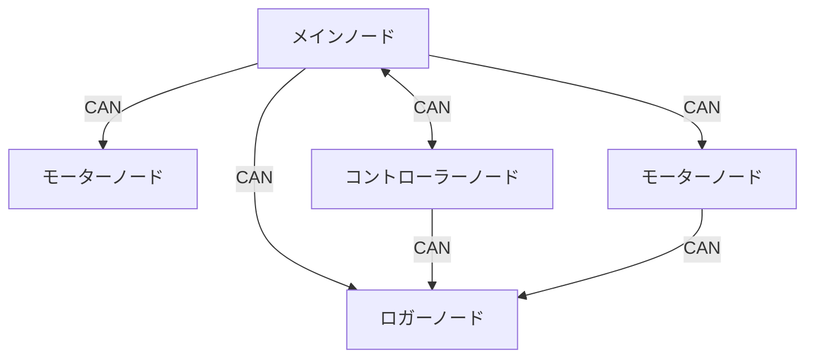

# CAN 通信

## Description

複数のデバイス間で通信を行う際の通信方式

### 用語

`バス` 通信線

`ノード` バスに接続されているマイコン等 (マイコン内にも複数作成可能)

`ノードID` 送信ノードの識別をするための固有値

### 特徴

`非同期通信`

`差動通信` ノイズの影響を受けにくい

`バス型通信` 複数のデバイスが同じバスを共有して通信

`マルチマスター方式` 各ノードが好きなタイミングでデータを送受信可能

受信する際は、流れているデータに含まれる ノード ID を見て受信 (送信者は関知しない)

> 詳しくは VECTOR 社の PDF がわかりやすかったので、そちらをご覧ください。[はじめての CAN / CAN FD](https://cdn.vector.com/cms/content/know-how/VJ/PDF/For_Beginners_CAN_CANFD.pdf)

### 通信イメージ



## Usage

CAN 通信クラスは、通信バスクラス、送受信ノードクラスから構成されています。

### インクルード

```cpp
#include <Udon.hpp>
// or
#include <Udon/Com/Can.hpp>
```

### バスクラス

`Udon::CanBus---`

通信が行えているかどうかのチェック、送受信処理を行います。

- teensy 使用時

  ```cpp
  static Udon::CanBusTeensy<CAN1> bus;
  ```

- CAN コントローラ使用時 ( SPI 経由 )

  このクラスは SPI 通信自体の管理には関わりません。そのため、SPI の通信開始等を別で行い、CAN 通信を始める前に SPI でデータを送受信できるようにしておく必要があります。

  ```cpp
  static Udon::CanBusSpi bus{ SPI };
  ```

### 送信クラス

`Udon::CanWriter<T>`

`T` に指定された型のオブジェクトをバスへ送信します。

```cpp
static Udon::CanBusTeensy<CAN1> bus;
static Udon::CanWriter<Udon::Vec2> writer{ bus, 10 };  // Udon::Vec2 を bus へ ノードID 10 として送信

void setup()
{
    bus.begin();  // 通信開始
}

void loop()
{
    bus.update();

    Udon::Vec2 vector{ 100.0, 200.0 };    // 送信するオブジェクトをインスタンス化
    writer.setMessage(vector);            // オブジェクトを登録

    delay(10);
}
```

### 受信クラス

`Udon::CanReader<T>`

`T` に指定された型のオブジェクトをバスから取得します。

```cpp
static Udon::CanBusTeensy<CAN1> bus;
static Udon::CanReader<Udon::Vec2> reader{ bus, 10 };  // bus から ノードID 10 のデータ(Udon::Vec2)を受信

void setup()
{
    bus.begin();
}
void loop()
{
    bus.update();

    if (const auto/*Udon::Optional<Udon::Vec2>*/ vector = reader.getMessage())  // データ取得
    {
        // 受信成功
        vector->show();
        Serial.println();
    }
    else
    {
        // 受信失敗(データ破損検出、通信タイムアウト等)
        Serial.println("receive failed!!");
    }

    delay(10);
}
```

> 通信タイムアウトを引き起こすので、常に受信し続ける必要があります。
>
> `getMessage` は正常にオブジェクトが受信できたかどうか判定できるように `Udon::Optional<T>` を返します。通信エラー時は `Udon::nullopt` が返されます。
> `Udon::Optional` は `operator bool` を持っているため if 文で正常に受信できたかどうかで分岐できます。
>
> `Udon::Optional<T>::operator->` で保持しているオブジェクトのメンバへアクセスでき、`Udon::Optional<T>::operator*` で optional が持っているオブジェクトの参照を取得できます。

### デバッグ

全 CAN 通信クラスは `show()` メンバ関数を持っており、通信の状態をシリアルモニターへ送信します。

```cpp
bus.show();     // バスに参加している送受信ノードの列挙、送受信データ(バイト列)を表示
reader.show();  // 受信データを表示
writer.show();  // 送信データを表示
```

### クラスの組み合わせ色々

一つのバスへ複数送受信ノードが参加する(よくある)

```cpp
static Udon::CanBusTeensy<CAN1> bus;
static Udon::CanWriter<Udon::Vec2> writer1{ bus, 11 };
static Udon::CanWriter<Udon::Vec2> writer2{ bus, 12 };
static Udon::CanReader<Udon::Vec2> reader1{ bus, 13 };
static Udon::CanReader<Udon::Vec2> reader2{ bus, 14 };
```

二つのバスへ受信ノードが参加する(バスの負荷分散目的)

```cpp
static Udon::CanBusTeensy<CAN1> bus1;
static Udon::CanWriter<Udon::Vec2> writer1{ bus1, 11 };
static Udon::CanReader<Udon::Vec2> reader1{ bus1, 13 };

static Udon::CanBusTeensy<CAN2> bus2;
static Udon::CanWriter<Udon::Vec2> writer2{ bus2, 12 };
static Udon::CanReader<Udon::Vec2> reader2{ bus2, 14 };
```

異なる種類のバスへ参加する(激レア)

```cpp
static Udon::CanBusTeensy<CAN1> bus1;
static Udon::CanWriter<Udon::Vec2> writer1{ bus1, 11 };
static Udon::CanReader<Udon::Vec2> reader1{ bus1, 13 };

static Udon::CanBusSpi bus2{ SPI };
static Udon::CanWriter<Udon::Vec2> writer2{ bus2, 12 };
static Udon::CanReader<Udon::Vec2> reader2{ bus2, 14 };
```

### API

- `Udon::ICanBus`

  バスクラスを一様に管理できるようにするためのインターフェースクラス

  すべてのバスクラスはこのクラスを継承しているため、`Udon::ICanBus` を引数に指定することで、継承されてたバスクラスをすべて受けることができます。

  - `virtual Udon::ICanBus::operator bool()`

    バスの有効性を取得

    `戻り値` 通信タイムアウト時 `false`

  - `virtual Udon::ICanBus::joinTx(CanNode& node)`

    送信ノードを参加させる

    `node` 送信ノード

  - `virtual Udon::ICanBus::joinRx(CanNode& node, void (*onReceive)(void*), void* p)`

    受信ノードを参加させる

    `node` 受信ノード

    `onReceive` 最終フレーム到達時に呼び出されるコールバック関数

    `p` コールバック関数の引数に渡すポインタ (this などを渡す)

  - `virtual Udon::ICanBus::leaveTx(CanNode& node)`

    送信ノードをバスから切り離す

  - `virtual Udon::ICanBus::leaveRx(CanNode& node)`

    受信ノードをバスから切り離す

- `Udon::CanBusTeensy`

  Teensy のバスクラス (Teensy は内部の CAN コントローラを使用します)

  送受信処理はタイマー割り込みによって行われます。

  `Udon::ICanBus` を継承しています。

  - `Udon::CanBusTeensy<Bus>::CanBusTeensy()`

    デフォルトコンストラクタ

    `Bus`: バスを選択する際に使用

    | Teensy     |                      |
    | ---------- | -------------------- |
    | Teensy 3.2 | `CAN0`               |
    | Teensy 3.5 | `CAN0`               |
    | Teensy 3.6 | `CAN0` `CAN1`        |
    | Teensy 4.0 | `CAN1` `CAN2` `CAN3` |

  - `Udon::CanBusTeensy::begin(uint32_t baudrate = 1000000)`

    通信開始

    `baudrate` CAN 通信レート

  - `Udon::CanBusTeensy::end()`

    通信終了(デストラクタからも呼ばれます)

  - `Udon::CanBusTeensy::update()`

    バス更新

  - `Udon::CanBusTeensy::show()`

    バスに参加している送受信ノードの列挙、送受信データ(バイト列)を表示

- `Udon::CanBusSpi`

  外部 CAN コントローラーを使用する SPI 経由バスクラス

  `Udon::ICanBus` を継承しています。

  **todo**

- `Udon::CanReader`

  - `Udon::CanReader<Message>::CanReader(ICanBus& bus, uint32_t id)`

    コンストラクタ

    `Message` 受信する型

    `bus` バスクラスインスタンス

    `id` 監視する送信ノードの ID

  - `Udon::CanReader::operator bool()`

    受信しているか取得

    `戻り値` 受信していれば `true`

  - `Udon::Optional<Message> Udon::CanReader::getMessage()`

    受信したオブジェクトを取得

  - `Udon::CanReader::show(char gap = '\t')`

    受信したオブジェクトを表示

    `gap` 区切り文字

  - `Udon::CanReader::showRaw(char gap = ' ')`

    受信バッファを表示

- `Udon::CanWriter`

  - `Udon::CanWriter<Message>::CanWriter(ICanBus& bus, uint32_t id)`

    コンストラクタ

    `Message` 送信する型

    `bus` バスクラスインスタンス

    `id` 自身のノード ID

  - `Udon::CanWriter::setMessage(Message message)`

    送信するオブジェクトをセット

    `message` 送信するオブジェクト

  - `Udon::CanWriter::show(char gap = '\t')`

    送信するオブジェクトを表示

    `gap` 区切り文字

  - `Udon::CanWriter::showRaw(char gap = ' ')`

    送信バッファを表示
