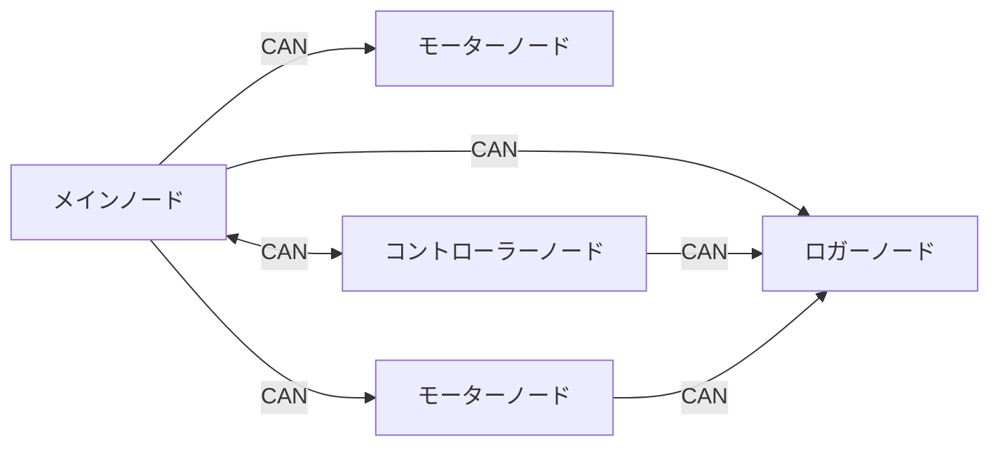

# CAN 通信

CAN 通信クラスは、通信バスクラス、送受信ノードクラスから構成されています。

- [通信バスクラス](#通信バスクラス)
  - [Teensy](#teensy)
  - [Raspberry Pi Pico](#raspberry-pi-pico)
  - [インターフェース](#インターフェース)
- [送信クラス](#送信クラス)
- [受信クラス](#受信クラス)
- [デバッグ](#デバッグ)
- [クラスの組み合わせ色々](#クラスの組み合わせ色々)

<details>
<summary> CAN 通信について </summary>

複数のデバイス間で通信を行う際の通信方式

### 用語

`バス` 通信線

`ノード` バスに接続されているマイコン等 (マイコン内にも複数作成可能)

`ノードID` 送信ノードの識別をするための固有値

### 特徴

`非同期通信`

`差動通信` ノイズの影響を受けにくい

`バス型通信` 複数のデバイスが同じバスを共有して通信

`マルチマスター方式` 各ノードが好きなタイミングでデータを送受信可能

受信する際は、流れているデータに含まれる ノード ID を見て受信 (送信者は関知しない)

> 詳しくは VECTOR 社の PDF がわかりやすかったので、そちらをご覧ください。[はじめての CAN / CAN FD](https://cdn.vector.com/cms/content/know-how/VJ/PDF/For_Beginners_CAN_CANFD.pdf)

### 通信イメージ



</details>

## インクルード

```cpp
#include <Udon/Com/Can.hpp>
```

## 通信バスクラス

送受信処理、通信が行えているかどうかのチェックを行います。使用するマイコンや CAN コントローラーによって使用するクラスが異なります。

> CAN の通信プロトコルは `CAN2.0A` を使用します。よって ID は `0x000` ~ `0x7FF` の範囲で使用できます。
>
> CAN2.0A プロトコルは一度に 8byte までしかデータを送ることができないので、8byte より多いデータは分割し送受信します。この時、1byte 目にはインデックスの番号が付与されます。
>
> 8byte 以下のデータはそのまま送受信するため、互換性があります。

### Teensy

- 概要

  Teensy 内臓 CAN コントローラーを使用し CAN 通信を行います。

  ```mermaid
  flowchart LR

    subgraph 基板
      Teensy --CAN TX/RX--> CANトランシーバー
    end

  CANトランシーバー --CAN H/L--> CANバス
  ```

- インスタンス化

  ```cpp
  static Udon::CanBusTeensy<CAN1> bus;
  ```

- 通信開始

  ```cpp
  bus.begin();
  // bus.begin(baudrate);
  ```

- 更新

  ```cpp
  bus.update();
  ```

- 詳細

  受信処理は受信割り込みで、送信は `update` 関数で行われます。

  受信ノードが 8 個以内の場合、受信フィルタの設定を行います。

### Raspberry Pi Pico

- 概要

  外部 CAN コントローラーを使用し CAN 通信を行います。コントローラーとは SPI で通信します。

  ```mermaid
  flowchart LR

    subgraph 基板
    Pico --SPI--> CANコントローラー/MCP2515 --CAN TX/RX--> CANトランシーバー
    end

    CANトランシーバー --CAN H/L--> CANバス
  ```

- 必要な情報

  Raspberry Pi Pico を用いて CAN 通信を行うには以下の情報が必要です。

  | 名称                                                                          | 指定場所                        | デフォルト値 |
  | ----------------------------------------------------------------------------- | ------------------------------- | ------------ |
  | CAN コントローラー動作用クロック端子と接続しているピン(Pico から出力する場合) | Udon::PioClockBegin(pin, clock) | -            |
  | CAN コントローラー割り込み端子と接続しているピン                              | begin 関数                      | -            |
  | CAN コントローラー SPI TX (MOSI) 端子と接続しているピン                       | begin 関数                      | 19           |
  | CAN コントローラー SPI RX (MISO) 端子と接続しているピン                       | begin 関数                      | 16           |
  | CAN コントローラー SPI SCK 端子と接続しているピン                             | begin 関数                      | 18           |
  | CAN コントローラー SPI CS 端子と接続しているピン                              | コンストラクタ                  | -            |
  | SPI 通信バス ( spi0, spi1 )                                                   | コンストラクタ                  | -            |
  | CAN コントローラー動作用クロック周波数                                        | begin 関数                      | 16MHz        |
  | CAN 通信速度                                                                  | begin 関数                      | 1Mbps        |

- インスタンス化

  ```cpp
  static Udon::CanBusSpi bus{ spi0, csPin };
  ```

- 通信開始

  通信を開始する関数は `begin()` と `beginCanOnly()` の二つあります。この関数は SPI 通信の開始処理も同時に行います。

  ```cpp
  bus.begin(intPin, txPin, rxPin, sckPin);
  // bus.begin(intPin, txPin, rxPin, sckPin, transceiverClock);
  // bus.begin(intPin, txPin, rxPin, sckPin, transceiverClock, canSpeed);
  ```

  `beginCanOnly()` は CAN 通信の開始処理のみ行い、この関数を呼ぶ前に SPI 通信ができる状態にしておく必要があります。同じ SPI バスを使うセンサー等がある場合、通信開始処理を CAN バスが行うべきでないので、この関数を呼び出します。

  ```cpp
  SPI.begin();

  bus.beginCanOnly(intPin);
  // bus.beginCanOnly(intPin, transceiverClock);
  // bus.beginCanOnly(intPin, transceiverClock, canSpeed);

  otherSensor.begin();
  ```

- 更新

  ```cpp
  bus.update();
  ```

- 詳細

  受信処理は外部割り込みで、送信は `update` 関数で行われます。

  受信ノードが 6 個以内の場合、受信フィルタの設定を行います。

<!--
### SPI 経由汎用クラス

```mermaid
flowchart LR

    subgraph 基板
    マイコン --SPI-> CANコントローラー --CAN TX/RX-> CANトランシーバー

    end

    CANトランシーバー --CAN H/L-> CANバス

```

- インスタンス化

  ```cpp
  static Udon::CanBusSpi bus{ SPI, csPin };
````

-->

### インターフェース

すべてのバスクラスを一様い扱えるようにするためのインターフェースクラス `Udon::ICanBus` クラスがあります。送受信クラスのコンストラクタの引数はこのインターフェースクラスになっており、どのバスでも使用できます。

## 送信クラス

`Udon::CanWriter<T>`

`T` に指定された型のオブジェクトをバスへ送信します。

```cpp
static Udon::CanBusTeensy<CAN1> bus;
static Udon::CanWriter<Udon::Vec2> writer{ bus, 10 };  // Udon::Vec2 を bus へ ノードID 10 として送信

void setup()
{
    bus.begin();
}

void loop()
{
    bus.update();

    Udon::Vec2 vector{ 100.0, 200.0 };    // 送信するオブジェクトをインスタンス化
    writer.setMessage(vector);            // オブジェクトを登録

    delay(10);
}
```

## 受信クラス

`Udon::CanReader<T>`

`T` に指定された型のオブジェクトをバスから取得します。送信クラスの `T` と同じ型である必要があります。

```cpp
static Udon::CanBusTeensy<CAN1> bus;
static Udon::CanReader<Udon::Vec2> reader{ bus, 10 };  // bus から ノードID 10 のデータ(Udon::Vec2)を受信

void setup()
{
    bus.begin();
}
void loop()
{
    bus.update();

    if (const auto/*Udon::Optional<Udon::Vec2>*/ vector = reader.getMessage())  // データ取得
    {
        // 受信成功
        vector->show();
        Serial.println();
    }
    else
    {
        // 受信失敗(データ破損検出、通信タイムアウト等)
        Serial.println("receive failed!!");
    }

    delay(10);
}
```

> 通信タイムアウトを引き起こすので、常に受信し続ける必要があります。
>
> `getMessage` は正常にオブジェクトが受信できたかどうか判定できるように `Udon::Optional<T>` を返します。通信エラー時は `Udon::nullopt` が返されます。
> `Udon::Optional` は `operator bool` を持っているため if 文で正常に受信できたかどうかで分岐できます。
>
> `Udon::Optional<T>::operator->` で保持しているオブジェクトのメンバへアクセスでき、`Udon::Optional<T>::operator*` で optional が持っているオブジェクトの参照を取得できます。

## デバッグ

全 CAN 通信クラスは `show()` メンバ関数を持っており、通信の状態をシリアルモニターへ送信します。

```cpp
bus.show();     // バスに参加している送受信ノードの列挙、送受信データ(バイト列)を表示
reader.show();  // 受信データを表示
writer.show();  // 送信データを表示
```

## クラスの組み合わせ色々

一つのバスへ複数送受信ノードが参加する(よくある)

```cpp
static Udon::CanBusTeensy<CAN1> bus;
static Udon::CanWriter<Udon::Vec2> writer1{ bus, 11 };
static Udon::CanWriter<Udon::Vec2> writer2{ bus, 12 };
static Udon::CanReader<Udon::Vec2> reader1{ bus, 13 };
static Udon::CanReader<Udon::Vec2> reader2{ bus, 14 };
```

二つのバスへ受信ノードが参加する(バスの負荷分散目的)

```cpp
static Udon::CanBusTeensy<CAN1> bus1;
static Udon::CanWriter<Udon::Vec2> writer1{ bus1, 11 };
static Udon::CanReader<Udon::Vec2> reader1{ bus1, 13 };

static Udon::CanBusTeensy<CAN2> bus2;
static Udon::CanWriter<Udon::Vec2> writer2{ bus2, 12 };
static Udon::CanReader<Udon::Vec2> reader2{ bus2, 14 };
```

異なる種類のバスへ参加する(激レア)

```cpp
static Udon::CanBusTeensy<CAN1> bus1;
static Udon::CanWriter<Udon::Vec2> writer1{ bus1, 11 };
static Udon::CanReader<Udon::Vec2> reader1{ bus1, 13 };

static Udon::CanBusSpi bus2{ SPI };
static Udon::CanWriter<Udon::Vec2> writer2{ bus2, 12 };
static Udon::CanReader<Udon::Vec2> reader2{ bus2, 14 };
```
