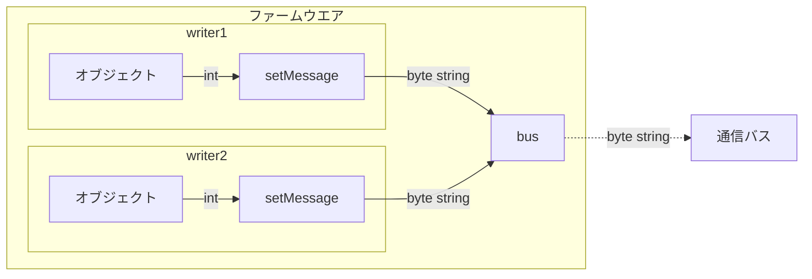
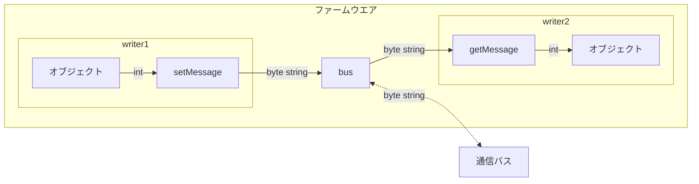
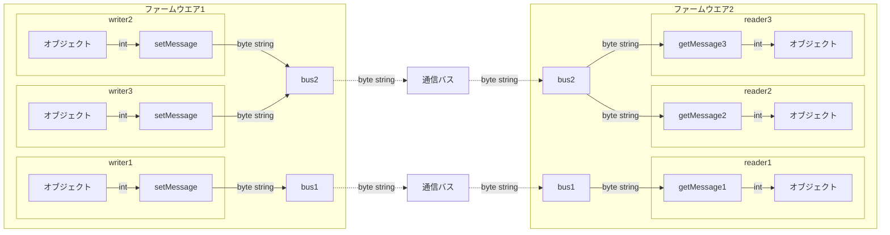

# 通信共通部

通信クラスのAPIを大体統一しているため、通信方式によらず同じようなプログラムを書くことができます。

## 共通内容

- 構造体等のオブジェクトを用いて通信を行います。

- 通信を管理するバスクラス、バスクラスとデータの受け渡しを行う送受信クラスから構成されています。

- 送受信クラスはテンプレート引数を持っており、通信するオブジェクトの型を指定します。

- 送信クラスの `setMessage(T)` を用いて送信し、受信クラスの `Optional<T> getMessage()` を用いて受信します。

## 送信者イメージ

```cpp
バスクラス bus;
送信クラス<int> writer{ bus, 0x01 };  // 送信先通信バスを登録

void setup()
{
    bus.begin();  // 通信開始
}

void loop()
{
    bus.update();  // 更新
    writer.setMessage(1000);  // バスへデータを送信
}
```

## 受信者イメージ

```cpp
バスクラス bus;
受信クラス<int> reader{ bus, 0x01 };  // 受信元通信バスを登録

void setup()
{
    bus.begin();
}

void loop()
{
    bus.update();

    if (const Optional<int> message = reader.getMessage())  // バスからデータを受信
    {
        Serial.println(*message);  // 受信成功 > 1000
    }
    else
    {
        Serial.println("receive failed");　// 受信エラー
    }
}
```

## 複数の通信バスや送受信者が存在する場合

バスクラスと送信者クラスに分けたことで、通信クラスを柔軟に組み合わせることができます。

通信によっては複数のバスや送受信者を立てることができない場合があります。

### 複数送信者



```cpp
バスクラス bus;
送信クラス<int> writer1{ bus, 0x01 };
送信クラス<int> writer2{ bus, 0x02 };

void setup()
{
    bus.begin();
}

void loop()
{
    bus.update();
    writer1.setMessage(1000);
    writer2.setMessage(2000);
}
```

### 送受信者



```cpp
バスクラス bus;
送信クラス<int> writer{ bus, 0x01 };
受信クラス<int> reader{ bus, 0x02 };

void setup()
{
    bus.begin();
}

void loop()
{
    bus.update();

    writer.setMessage(1000);

    if (const auto message = reader.getMessage())
    {
        Serial.println(*message);
    }
    else
    {
        Serial.println("receive failed");
    }
}
```

### 複数バス、複数送受信



```cpp
バスクラス bus1;
バスクラス bus2;

送信クラス<int> writer1{ bus1, 0x01 };
送信クラス<int> writer2{ bus2, 0x01 };
送信クラス<int> writer3{ bus2, 0x02 };

void setup()
{
    bus1.begin();
    bus2.begin();
}

void loop()
{
    bus1.update();
    bus2.update();
    writer1.setMessage(1000);
    writer2.setMessage(2000);
    writer3.setMessage(3000);
}
```

```cpp
バスクラス bus1;
バスクラス bus2;

受信クラス<int> reader1{ bus1, 0x01 };
受信クラス<int> reader2{ bus2, 0x01 };
受信クラス<int> reader3{ bus2, 0x02 };

void setup()
{
    bus1.begin();
    bus2.begin();
}

void loop()
{
    bus1.update();
    bus2.update();

    if (const auto message = reader1.getMessage())
    {
        Serial.println(*message);
    }
    else
    {
        Serial.println("receive failed");
    }

    if (const auto message = reader2.getMessage())
    {
        Serial.println(*message);
    }
    else
    {
        Serial.println("receive failed");
    }

    if (const auto message = reader3.getMessage())
    {
        Serial.println(*message);
    }
    else
    {
        Serial.println("receive failed");
    }
}
```
