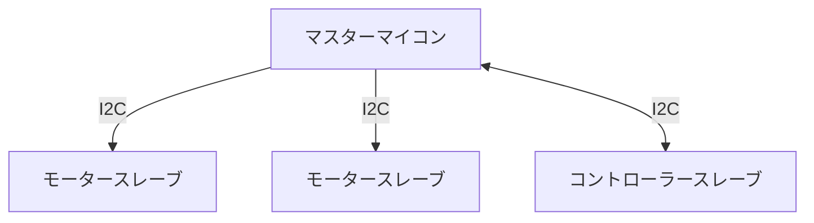

# I2C 通信

<details>
<summary> I2C 通信について </summary>

複数のデバイス間で通信を行う際の通信方式

### 用語

`バス` 通信線

`マスター` 通信を制御するデバイス (1 つのバスに 1 つ)

`スレーブ` マスターに従って通信を行うデバイス (1 つのバスに複数)

`アドレス` スレーブに割り当てる固有値

### 特徴

`同期通信`

`バス型通信` 複数のデバイスが同じバスを共有して通信

`マスタースレーブ方式` マスターがデータのやり取りを管理 スレーブ同士で通信することはできません。

### 通信イメージ



</details>

## Usage

I2C 通信クラスは、通信バスクラス、マスター側送受信クラス、スレーブ側送受信クラスから構成されています。

### インクルード

```cpp

#include <Udon/Com/I2c.hpp>
```

### バスクラス

`Udon::I2cBus`

Arduino の `TwoWire` クラスとほとんど同等の機能を持ちますが、通信タイムアウト時にバスの再起動を行う機能が追加されています。

```cpp
Udon::I2cBus bus{ Wire };
```

使用方法は各送受信クラスのサンプルを参照してください。

通信開始時、マスターモードの場合 `begin(void)`、スレーブモードの場合 `begin(address)` を呼び出す点に注意してください。

### マスター側

- 送信クラス

  `Udon::I2cMasterWriter<T>`

  `T` に指定された型のオブジェクトをスレーブへ送信します。

  [サンプル](./../../example/Com/I2c/I2cMasterWriter/I2cMasterWriter.ino)

- 受信クラス

  `Udon::I2cMasterReader<T>`

  `T` に指定された型のオブジェクトをスレーブから受信します。

  [サンプル](./../../example/Com/I2c/I2cMasterReader/I2cMasterReader.ino)

> スレーブの個数に合わせて複数インスタンス化できます。

### スレーブ側

- 送信クラス

  `Udon::I2cSlaveWriter<T>`

  `T` に指定された型のオブジェクトをマスターへ送信します。

  [サンプル](./../../example/Com/I2c/I2cSlaveWriter/I2cSlaveWriter.ino)

- 受信クラス

  `Udon::I2cSlaveReader<T>`

  `T` に指定された型のオブジェクトをマスターから受信します。

  [サンプル](./../../example/Com/I2c/I2cSlaveReader/I2cSlaveReader.ino)

> マスターは 1 つであるため、複数インスタンス化できません。
>
> 送受信クラスをそれぞれ一つずつインスタンス化することはできます。
