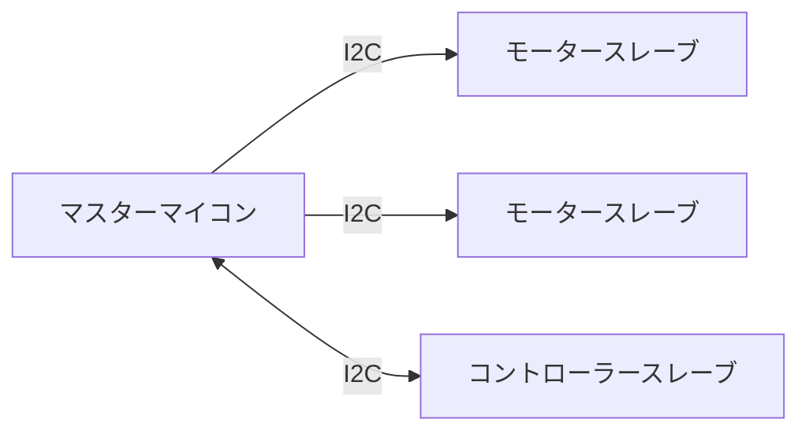

# I2C 通信

```cpp
#include <Udon/Com/I2c.hpp>
```

I2C 通信クラスは、通信バスクラス、マスター側送受信クラス、スレーブ側送受信クラスから構成されています。

<details>
<summary> I2C 通信について </summary>

複数のデバイス間で通信を行う際の通信方式

### 用語

`バス` 通信線

`マスター` 通信を制御するデバイス (1 つのバスに通常 1 つ)

`スレーブ` マスターに従って通信を行うデバイス (1 つのバスに複数)

`アドレス` スレーブに割り当てる固有値

### 特徴

`同期通信`

`バス型通信` 複数のデバイスが同じバスを共有して通信

`マスタースレーブ方式` マスターがデータのやり取りを管理 スレーブ同士で通信することはできません。

### 通信イメージ



</details>

## バスクラス

`Udon::I2cBus`

Arduino の `TwoWire` クラスへ通信タイムアウト時にバスの再起動を行う機能が追加されてたバスクラスです。使用方法は各送受信クラスのサンプルを参照してください。

通信開始時、マスターモードの場合 `begin(void)`、スレーブモードの場合 `begin(address)` を呼び出す点に注意してください。

## マスター側

### 送信クラス

`Udon::I2cMasterWriter<T>`

`T` に指定された型のオブジェクトをスレーブへ送信します。スレーブの数に応じて複数インスタンス化可能です。

```cpp
#include <Udon.hpp>

Udon::I2cBus bus{ Wire };
Udon::I2cMasterWriter<Udon::Vec2> writer{ bus, 6 };

void setup()
{
    bus.begin();
}

void loop()
{
    bus.update();

    writer.setMessage({ millis(), micros() });
    writer.update();

    delay(10);
}
```

### 受信クラス

`Udon::I2cMasterReader<T>`

`T` に指定された型のオブジェクトをスレーブから受信します。スレーブの数に応じて複数インスタンス化可能です。

```cpp
#include <Udon.hpp>

Udon::I2cBus bus{ Wire };
Udon::I2cMasterReader<Udon::Vec2> reader{ bus, 6 };

void setup()
{
    Serial.begin(115200);
    bus.begin();
}

void loop()
{
    bus.update();

    reader.update();
    if (const auto message = reader.getMessage())
    {
        message->show();
    }
    else
    {
        Serial.print("receive failed");
    }
    Serial.println();

    delay(10);
}
```

## スレーブ側

### 送信クラス

`Udon::I2cSlaveWriter<T>`

`T` に指定された型のオブジェクトをマスターへ送信します。複数インスタンス化できません。

```cpp
#include <Udon.hpp>

Udon::I2cBus bus{ Wire };
Udon::I2cSlaveWriter<Udon::Vec2> writer{ bus };

void setup()
{
    bus.begin(6);  // 自身のアドレス
    writer.begin();
}

void loop()
{
    bus.update();

    writer.setMessage({ millis(), micros() });

    delay(10);
}
```

### 受信クラス

`Udon::I2cSlaveReader<T>`

`T` に指定された型のオブジェクトをマスターから受信します。複数インスタンス化できません。

```cpp
#include <Udon.hpp>

Udon::I2cBus bus{ Wire };
Udon::I2cSlaveReader<Udon::Vec2> reader{ bus };

void setup()
{
    Serial.begin(115200);

    bus.begin(6);  // 自身のアドレス
    reader.begin();
}

void loop()
{
    bus.update();

    if (const auto message = reader.getMessage())
    {
        message->show();
    }
    else
    {
        Serial.print("receive failed");
    }
    Serial.println();

    delay(10);
}
```
