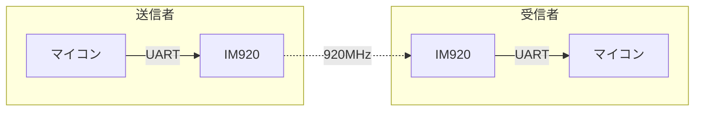

# IM920

<details>
<summary> IM920について </summary>

920MHz 帯 インタープラン社製無線モジュール

### 特徴

無線通信

UART で IM920 モジュールとデータのやり取りを行います。

免許や申請手続き不要。電波法関係はモジュール内部で自動的に制御されます。

### 通信イメージ



### 公式ページ

[IM920](https://www.interplan.co.jp/solution/wireless/im920/)
[IM920s](https://www.interplan.co.jp/solution/wireless/im920s/)
[IM920sL](https://www.interplan.co.jp/solution/wireless/im920sl/)

</details>

## Usage

通信するモジュール同士はあらかじめペアリングされている必要があります。ペアリング方法はインタープラン社の公式ページを参照ください。

IM920 通信クラスは、通信モジュールクラス、送受信クラスから構成されています。

一対一での通信のみ対応しています。

### インクルード

```cpp

#include <Udon/Com/Im920.hpp>
```

### 通信モジュールクラス

使用するモジュールの種類によって使用するクラスを切り替えます。

`Udon::Im920`
`Udon::Im920s`
`Udon::Im920sL`

コンストラクタの引数に Im920 と通信するシリアルクラスのインスタンスを指定します。

```cpp
Udon::Im920 im920{ Serial1 };
```

詳細は送受信クラスのサンプルを参照してください。

### 送信クラス

`Udon::Im920Writer<T>`

`T` に指定された型のオブジェクトを Im920 へ送信します。

詳細は [サンプル](./../../example/Com/Im920/Im920Writer/Im920Writer.ino)

### 受信クラス

`Udon::Im920Reader<T>`

`T` に指定された型のオブジェクトを Im920 から受信します。

詳細は [サンプル](./../../example/Com/Im920/Im920Reader/Im920Reader.ino)
