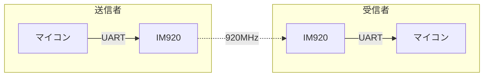

# IM920

> [!CAUTION]
> 現在部で使用していないため動作するか不明です。

## 通信イメージ



## 公式ページ

[IM920](https://www.interplan.co.jp/solution/wireless/im920/)
[IM920s](https://www.interplan.co.jp/solution/wireless/im920s/)
[IM920sL](https://www.interplan.co.jp/solution/wireless/im920sl/)

</details>

## 個別インクルード

```cpp
#include <Udon/Com/Im920.hpp>
```

## Usage

通信するモジュール同士はあらかじめペアリングされている必要があります。ペアリング方法はインタープラン社の公式ページを参照ください。

IM920 通信クラスは、通信モジュールクラス、送受信クラスから構成されています。

一対一での通信のみ対応しています。

## Im920 クラス

使用するモジュールの種類によって使用するクラスを切り替えます。

`Udon::Im920`
`Udon::Im920s`
`Udon::Im920sL`

コンストラクタの引数に Im920 と通信するシリアルクラスのインスタンスを指定します。詳細は送受信クラスのサンプルを参照してください。

## 送信クラス

`Udon::Im920Writer<T>`

`T` に指定された型のオブジェクトを Im920 へ送信します。

```cpp
#include <Udon.hpp>

Udon::Im920 im920{ Serial1 };
Udon::Im920Writer<Udon::Vec2> writer{ im920 };

void setup()
{
    im920.begin(13);  // チャンネル番号
}

void loop()
{
    im920.update();

    writer.setMessage({ (double)millis(), (double)micros() });

    delay(10);
}
```

## 受信クラス

`Udon::Im920Reader<T>`

`T` に指定された型のオブジェクトを Im920 から受信します。

```cpp
#include <Udon.hpp>

Udon::Im920 im920{ Serial1 };  // Im920と通信するシリアルクラスのインスタンスを指定
Udon::Im920Reader<Udon::Vec2> reader{ im920 };

void setup()
{
    Serial.begin(115200);
    im920.begin(13);  // チャンネル番号
}

void loop()
{
    im920.update();

    if (const auto message = reader.getMessage())
    {
        message->show();
    }
    else
    {
        Serial.print("receive failed");
    }
    Serial.println();

    delay(10);
}
```
