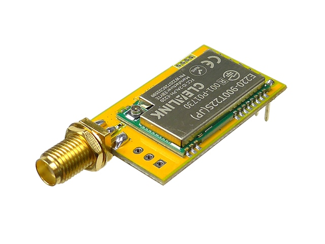

# LoRa

920MHz 帯無線モジュール

## E220



### 特徴

👍

- 安い(秋月で 2000 円)！！
- UART で通信楽々！！
- ペアリング不要！！
- SMA 端子が付いていて接触不良が起きにくい！
- 受信完了を AUX ピンから確認できるので、UART でよくあるバイト列のズレが起きない！
- バイト列を直接送信できる(文字列にする必要がない)！

👊

- 受信間隔長め (8byte で 80ms 程度)

### スケッチ例 / 受信側

```cpp
#include <Udon.hpp>

Udon::E220Reader<uint64_t> lora({
    .serial = Serial1,
    .m0 = 2,
    .m1 = 3,
    .aux = 4,
    .channel = 0
});

void setup()
{
    lora.begin();
}

void loop()
{
    if (const Udon::Optional<uint64_t> message = lora.getMessage())
    {
        Serial.println(*message);
    }
    else
    {
        Serial.println("receive timeout!");
    }
    delay(10);
}
```

### スケッチ例 / 送信側

```cpp
#include <Udon.hpp>

Udon::E220Writer<uint64_t> lora({
    .serial = Serial1,
    .m0 = 2,
    .m1 = 3,
    .aux = 4,
    .channel = 0
});

void setup()
{
    lora.begin();
}

void loop()
{
    lora.setMessage(millis());
    delay(1);
}
```

### 設定値の変更

設定用構造体は以下のように定義されています。

デフォルトはユニキャスト通信(1 対 1)です。送信側のアドレスを `0xffff` にすることでブロードキャスト通信(1 対多)になります。この時受信側アドレスは無視されます。

```cpp
struct Config
{
    HardwareSerial& serial;    // シリアルポート

    uint8_t m0;     // M0 ピン
    uint8_t m1;     // M1 ピン
    uint8_t aux;    // AUX ピン

    /// @brief チャンネル
    /// @note 0-12 (13-30も使用できますが通信速度が遅くなります)
    /// @note 相手と合わせる
    uint8_t channel = 0;

    /// @brief アドレス
    /// @note 0x0000-0xFFFF
    /// @note 相手と合わせる
    uint16_t address = 0x0102;
};
```

コンストラクタで設定した値は `getConfigReference()` メンバ関数を使用して変更可能です。変更は `begin()` メンバ関数を呼び出す前に行う必要があります。

```cpp
void setup()
{
    lora.getConfigReference().channel = 2;
    lora.begin();
}
```

### 受信強度

`getRssi()` メンバ関数を使用して電波強度を示す RSSI 値を取得できます。0 に近いほど電波強度が高いことを示します。値は通信できている場合のみ有効です。

```cpp
void loop()
{
    if (const auto m = lora.getMessage())
    {
        const int rssi = lora.getRssi();
    }
}
```

[metageek 社による指標](https://www.metageek.com/training/resources/understanding-rssi/) では RSSI 値と品質の対応は次のようになっています。

| RSSI [dBm] | 品質       |
| ---------- | ---------- |
| -30        | 非常に強い |
| -67        | とても強い |
| -70        | 強い       |
| -80        | 弱い       |
| -90        | 使えない   |

### 周波数

チャンネルを変更することで周波数帯の調整ができます。チャンネルから周波数は以下式で求められます。

$$
周波数 = 920.8MHz + チャンネル番号×200kHz
$$
