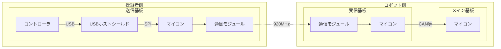
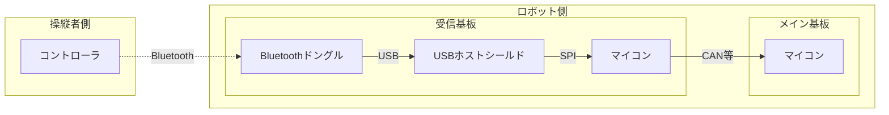

# コントローラ

コントローラのデータは会場の WiFi や Bluetooth との干渉を防ぐために 920MHz 帯の周波数に変換しロボットへ送信します。



上の図が示す通り、コントローラの情報を取得するには 3 つのマイコンのファームウエアを書く必要があります 🥶

- [送信側マイコン](#)
- 受信側マイコン
- [メインマイコン](#メインマイコン用クラス)

Bluetooth を使用すると少し簡単になります。受信マイコンを経由させることで、メインマイコンのファームウエアは同じものを使用できます。



## メインマイコン用クラス

メインマイコンではロボット側の受信側マイコンから送信されたデータの解析、ボタンなどの情報への変換を行います。

### 個別インクルード

```cpp
#include <Udon/Com/Pad.hpp>
```

### インスタンス化

受信側マイコンとの通信方式によって使用するコントローラクラスが異なります。

I2C 通信経由

```cpp
static Udon::I2cPadPS5 pad{ bus, address };
```

CAN 通信経由

```cpp
static Udon::CanPadPS5 pad{ bus, id };
```

その他の通信経由

```cpp
static Udon::PadPS5<Udon::xxxxReader> pad{ xxxxReaderクラスのコンストラクタ引数 };
```

OpenSiv3D 使用時 (OpenSiv3D 使用時は通信を経由させる必要はありません。 PC と USB ケーブルで接続するだけで使用できます。)

```cpp
static SivPadPS5 pad;
// 複数コントローラを使用する場合
static SivPadPS5 pad{ index };
```

### 更新

ループ内で `update` メンバ関数を呼ぶ必要があります。

```cpp
xxxPadPS5 pad{ ... };

void setup()
{
}
void loop()
{
    pad.update();
}
```

### コントローラの状態取得

コントローラが接続されているかを `operator bool` によって取得できます。

```cpp
void loop()
{
    pad.update();
    if (pad)
    {
        // 接続時
    }
    else
    {
        // 未接続時
    }
}
```

### ボタン

以下の関数からボタンの状態を `Input` オブジェクトとして取得できます。

```cpp
void loop()
{
    pad.update();
    Udon::Input input = pad.getTriangle();
    Udon::Input input = pad.getCircle();
    Udon::Input input = pad.getCross();
    Udon::Input input = pad.getSquare();
    Udon::Input input = pad.getUp();
    Udon::Input input = pad.getRight();
    Udon::Input input = pad.getDown();
    Udon::Input input = pad.getLeft();
    Udon::Input input = pad.getL1();
    Udon::Input input = pad.getR1();
    Udon::Input input = pad.getL2();
    Udon::Input input = pad.getR2();
    Udon::Input input = pad.getL3();      // 左スティック押し込み
    Udon::Input input = pad.getR3();      // 右スティック押し込み
    Udon::Input input = pad.getCreate();  // クリエイトボタン(左上ボタン)
    Udon::Input input = pad.getOption();  // オプションボタン(右上ボタン)
    Udon::Input input = pad.getTouch();
    Udon::Input input = pad.getPs();
}
```

> `Input` オブジェクトは以下の様に定義されており、各ボタンの押された瞬間、離した瞬間等を取得できます。
>
> ```cpp
> struct Input
> {
>     bool press;    // 押されているか
>     bool click;    // 押された瞬間か
>     bool release;  // 離された瞬間か
>     bool toggle;   // 押すごとに入れ替わる
> };
> ```
>
> ```cpp
> // 三角ボタンが押されているか
> const bool trianglePressed = pad.getTriangle().press;
> ```

### スティック

以下の関数から左右のスティックの値を `Vec2` オブジェクトして取得可能です。

```cpp
void loop()
{
    pad.update();
    Udon::Vec2 left  = pad.getLeftStick();
    Udon::Vec2 right = pad.getRightStick();
}
```

> `Vec2` オブジェクトは以下の様に定義されており、各スティックの x, y 軸の値を取得できます。
>
> ```cpp
> struct Vec2
> {
>     double x;
>     double y;
> };
> ```
>
> ```cpp
> // 左スティックのx軸の傾き
> const double leftX = pad.getLeftStick().x;
> ```

また、`Stick` オブジェクトを取得できる関数もあります。`Stick` オブジェクトとはロボットの移動に必要な入力成分 (移動: 左 X,Y、旋回: 右 X) をまとめたオブジェクトで、このオブジェクトを用いてオムニホイールの出力値を求めたりすることもできます。

```cpp
Udon::Stick stick = pad.getMoveInfo();
```

> `Stick` オブジェクトは以下の様に定義されています。
>
> ```cpp
> struct Stick
> {
>     Vec2 vector;  // 平行移動成分 (左スティック)
>     double turn;  // 旋回成分 (右スティックのX成分)
> };
> ```
>
> ```cpp
> // スティックからオムニの出力値を求める
> const std::array<double, 4> omni = pad.getMoveInfo().toOmni();
> ```

## 送信側マイコン用クラス

送信側マイコンは USB ホストシールドからコントローラの情報を受け取り、無線モジュールへの転送を行います。

### USB ホストシールドとの通信

まず `PadPS5USB.hpp` をインクルードします。このファイルは USB_Host_Shield_2.0 ライブラリに依存しており、サイズが大きいため Udon.hpp からインクルードされていません。

```cpp
#include <Udon/Com/Pad/PadPS5USB.hpp>
```

```cpp
#include <Udon.hpp>
#include <Udon/Com/Pad/PadPS5USB.hpp>

Udon::I2cBus bus{ Wire };

Udon::I2cSlaveWriter<Udon::Message::PadPS5> writer{ bus };

Udon::PadPS5USB pad;

void setup()
{
    Serial.begin(115200);
    if (not pad.begin())
    {
        Serial.println(F("PS5USB failed to start!"));
        for (;;)
            ;
    }
    bus.begin(6);
    writer.begin();
}

void loop()
{
    bus.update();

    const Udon::Message::PadPS5 message = pad.getButtons();

    pad.setLightBar({ 0x38b48b });
    pad.setMicLed(true);
}
```