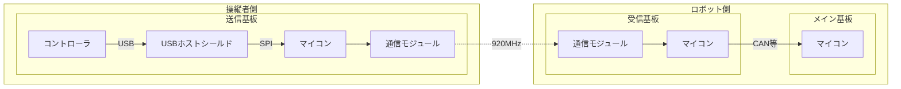
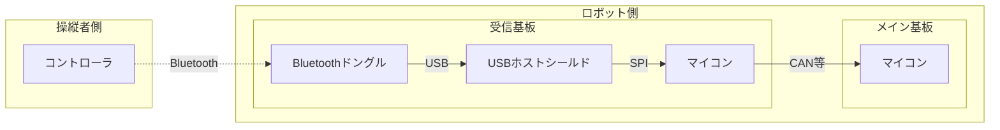

# コントローラ

### 920MHz 経由

コントローラのデータはロボコン会場の WiFi や Bluetooth との干渉を防ぐために 920MHz 帯の周波数に変換しロボットへ送信します。



上の図に示す通り、コントローラの情報を取得するには 3 つのマイコンのファームウエアを書く必要があります 🥶

- [送信側マイコン](#送信側マイコン用クラス)
- [受信側マイコン](#受信側マイコン用クラス)
- [メインマイコン](#メインマイコン用クラス)

### Bluetooth 接続

Bluetooth を使用すると少し簡単になります。メインマイコンのファームウエアは同じものを使用できます。



- [ペアリング](#bluetooth-ドングルとのペアリング)
- [受信側マイコン](#bluetooth-使用時の受信側マイコン用クラス)
- [メインマイコン](#メインマイコン用クラス)

## メインマイコン用クラス

メインマイコンは受信したデータを扱いやすい形に変換し、機構の制御に使用します。

### 個別インクルード

```cpp
#include <Udon/Com/Pad.hpp>
```

### インスタンス化

受信側マイコンとの通信方式によって使用するコントローラクラスが異なります。

I2C 通信経由

```cpp
static Udon::I2cBus bus{ Wire };
static Udon::I2cPadPS5 pad{ bus, address };
```

CAN 通信経由

```cpp
static Udon::CanBusTeensy<CAN1> bus;
static Udon::CanPadPS5 pad{ bus, id };
```

その他の通信経由

```cpp
static Udon::PadPS5<Udon::xxxxReader> pad{ xxxxReaderクラスのコンストラクタ引数 };
```

OpenSiv3D 使用時 (OpenSiv3D 使用時は通信を経由させる必要はありません。 PC と USB ケーブルで接続するだけで使用できます。)

```cpp
static SivPadPS5 pad;
static SivPadPS5 pad{ index };  // 複数コントローラを使用する場合
```

### 更新

ループ内で `update` メンバ関数を呼ぶ必要があります。

```cpp
static xxxPadPS5 pad{ ... };

void setup()
{
}
void loop()
{
    pad.update();
}
```

### コントローラの状態取得

コントローラが接続されているかを `operator bool` によって取得できます。未接続時には非常停止を行う等の処理が想定されます。

```cpp
void loop()
{
    pad.update();
    if (pad)
    {
        // 接続時
    }
    else
    {
        // 未接続時
        // arm.stop();
    }
}
```

### ボタン

以下の関数からボタンの状態を `Input` オブジェクトとして取得できます。

```cpp
void loop()
{
    pad.update();
    Udon::Input input = pad.getTriangle();
    Udon::Input input = pad.getCircle();
    Udon::Input input = pad.getCross();
    Udon::Input input = pad.getSquare();
    Udon::Input input = pad.getUp();
    Udon::Input input = pad.getRight();
    Udon::Input input = pad.getDown();
    Udon::Input input = pad.getLeft();
    Udon::Input input = pad.getL1();
    Udon::Input input = pad.getR1();
    Udon::Input input = pad.getL2();
    Udon::Input input = pad.getR2();
    Udon::Input input = pad.getL3();      // 左スティック押し込み
    Udon::Input input = pad.getR3();      // 右スティック押し込み
    Udon::Input input = pad.getCreate();  // クリエイトボタン(左上ボタン)
    Udon::Input input = pad.getOption();  // オプションボタン(右上ボタン)
    Udon::Input input = pad.getTouch();
    Udon::Input input = pad.getPs();
}
```

> `Input` オブジェクトは以下の様に定義されており、各ボタンの押された瞬間、離した瞬間等を取得できます。
>
> ```cpp
> struct Input
> {
>     bool press;    // 押されているか
>     bool click;    // 押された瞬間か
>     bool release;  // 離された瞬間か
>     bool toggle;   // 押すごとに入れ替わる
> };
> ```
>
> ```cpp
> // 三角ボタンが押されているか
> const bool trianglePressed = pad.getTriangle().press;
> ```

### スティック

以下の関数から左右のスティックの値を `Vec2` オブジェクトして取得可能です。

```cpp
void loop()
{
    pad.update();
    Udon::Vec2 left  = pad.getLeftStick();
    Udon::Vec2 right = pad.getRightStick();
}
```

> `Vec2` オブジェクトは以下の様に定義されており、各スティックの X, Y 軸の傾きを取得できます。スティックの上方向が X 軸の正、右方向が Y 軸の正です。
>
> ```cpp
> struct Vec2
> {
>     double x;
>     double y;
> };
> ```
>
> ```cpp
> // 左スティックのx軸の傾き
> const double leftX = pad.getLeftStick().x;
> ```

また、`Stick` オブジェクトを取得できる関数もあります。`Stick` オブジェクトとはロボットの移動に必要な入力成分 (移動: 左 X,Y、旋回: 右 X) をまとめたオブジェクトで、このオブジェクトを用いてオムニホイールの出力値を求めたりすることもできます。

```cpp
Udon::Stick stick = pad.getMoveInfo();
```

> `Stick` オブジェクトは以下の様に定義されています。
>
> ```cpp
> struct Stick
> {
>     Vec2 vector;  // 平行移動成分 (左スティック)
>     double turn;  // 旋回成分 (右スティックのX成分)
> };
> ```
>
> ```cpp
> // スティックからオムニの出力値を求める
> const std::array<double, 4> omni = pad.getMoveInfo().toOmni();
> ```

### 最終的なスケッチ例

```cpp
// CAN バスからコントローラの情報を取得する例

#include <Udon.hpp>

static Udon::CanBusTeensy<CAN1> bus;
static Udon::CanPadPS5 pad{ bus, 0x006 };

void setup()
{
    bus.begin();
}

void loop()
{
    bus.update();
    pad.update();

    if (pad.getCircle().click)
    {
        Serial.println("circle clicked");
    }

    delay(1);
}

```

## 送信側マイコン用クラス

送信側マイコンは USB ホストシールドからコントローラの情報を受け取り、無線モジュールへの転送を行います。

`PadPS5USB.hpp` を個別にインクルードする必要があります。このファイルは USB_Host_Shield_2.0 ライブラリに依存しており、サイズが大きいため Udon.hpp からインクルードされていません。

`getButtons()` から `Udon::Message::PadPS5` 型オブジェクトを取得できます。このオブジェクトを送信クラスへ渡すことでコントローラの情報の転送が行えます。

```cpp
// コントローラの情報を LoRa へ転送する例

#include <Udon.hpp>
#include <Udon/Com/Pad/PadPS5USB.hpp>

static Udon::PadPS5USB pad;

static Udon::E220Writer<Udon::Message::PadPS5> lora({
    .serial = Serial1,
    .m0 = 2,
    .m1 = 3,
    .aux = 4,
    .channel = 0,
});

void setup()
{
    pad.begin();
    lora.begin();
}

void loop()
{
    pad.update();

    const Udon::Message::PadPS5 message = pad.getButtons();
    lora.setMessage(message);
    // 省略形: lora.setMessage(pad.getButtons());

    delay(1);
}
```

コントローラに内蔵されている LED や、バイブレーションを動作させることもできます。

```cpp
pad.setLightBar({ 0x38b48b });   // タッチパネルサイドLED (色指定可能)
pad.setMicLed(true);             // マイクLED
pad.setPlayerLamp();             // タッチパネル下部LED (5つ)
pad.vibrate(100, 100);           // 左右バイブレーションモーター
```

## 受信側マイコン用クラス

受信マイコンは無線モジュールから取得した `Udon::Message::PadPS5` 型オブジェクトをメインマイコンへ転送する役を担います。

```cpp
// LoRa で受信したデータを CAN バスへ送信する例

#include <Udon.hpp>

static Udon::E220Reader<Udon::Message::PadPS5> lora({
    .serial = Serial1,
    .m0 = 2,
    .m1 = 3,
    .aux = 4,
    .channel = 0,
});

static Udon::CanBusTeensy<CAN1> bus;
static Udon::CanWriter<Udon::Message::PadPS5> writer{ bus, 0x006 };

void setup()
{
    lora.begin();
    bus.begin();
}

void loop()
{
    bus.update();

    // LoRa から CAN に転送
    if (const auto message = lora.getMessage())
    {
        writer.setMessage(*message);
    }
    else
    {
        writer.setMessage({});
    }

    delay(1);
}
```

## Bluetooth 使用時の受信側マイコン用クラス

あらかじめコントローラと Bluetooth ドングルがペアリングされている必要があります。[ペアリング方法](#bluetooth-ドングルとのペアリング)

`PadPS5BT.hpp` を個別にインクルードする必要があります。使い方は `PadPS5USB` クラスと同じです。

```cpp
// コントローラの情報を CAN バスへ転送する例

#include <Udon.hpp>
#include <Udon/Com/Pad/PadPS5BT.hpp>

static Udon::PadPS5BT pad;

static Udon::CanBusTeensy<CAN1> bus;
static Udon::CanWriter<Udon::Message::PadPS5> writer{ bus, 0x006 };

void setup()
{
    pad.begin();
    bus.begin();
}

void loop()
{
    pad.update();
    bus.update();

    writer.setMessage(pad.getButtons());
}
```

`PadPS5USB` クラスと同じく、コントローラに内蔵されている LED や、バイブレーションを動作させることもできます。

```cpp
pad.setLightBar({ 0x38b48b });   // タッチパネルサイドLED (色指定可能)
pad.setMicLed(true);             // マイクLED
pad.setPlayerLamp();             // タッチパネル下部LED (5つ)
pad.vibrate(100, 100);           // 左右バイブレーションモーター
```

## Bluetooth ドングルとのペアリング

Bluetooth を使用してコントローラのデータを取得する場合、USB ドングルとのペアリングが必要です。一度ペアリングすると以降はペアリングする必要ありません。

コンストラクタに `PAIR` を渡すことで USB ホストシールドがペアリングモードで起動します。

クリエイトボタン、PS ボタンをライトバーが点滅するまで長押しすることで、コントローラ側もペアリングモードになります。ペアリングは通常数秒で終わります。マイコンのリセットペアリングが成功するとライトバーが点灯します。

> ペアリングに時間がかかる場合、マイコンをリセットすることで大抵つながります。またホストシールドは電源電圧に敏感であるため、電圧値が正常か確認してください。

```cpp
// ペアリング用スケッチ

#include <UdonFwd.hpp>
#include <Udon/Com/Pad/PadPS5BT.hpp>

static Udon::PadPS5BT pad{ PAIR };

void setup()
{
    pad.begin();
}

void loop()
{
    pad.update();
}
```
