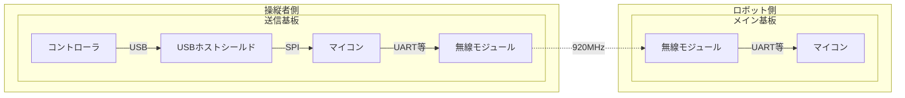
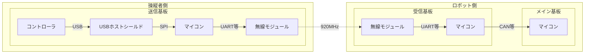
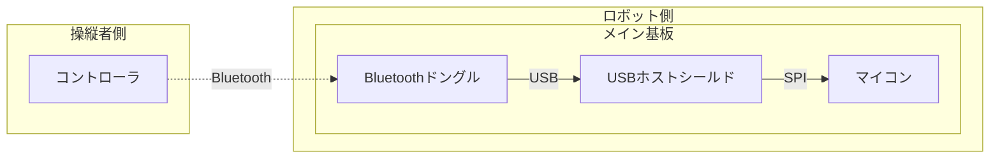
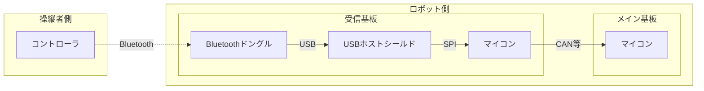
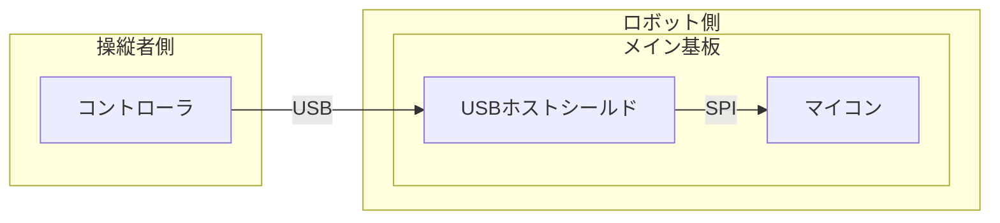

# コントローラーの構成

## 構成を考える

PS5 コントローラー は Bluetooth を用いて通信を行いますが、ロボコン会場には WiFi や Bluetooth が多く存在するため、混線する可能性があります。そこで 920MHz 帯を用いて通信します。小規模なロボットや、混線が置きにくいような環境下では Bluetooth を用いて構成することも可能です。

メインマイコン側のドキュメントは [こちら](./Pad.md) にあります。

### ■ 920MHz 経由 / 無線モジュールがメイン基板にある場合 (推奨)



- [送信基板マイコン](#送信側マイコン用クラス)

### ■ 920MHz 経由 / 無線モジュールとメイン基板が別々の場合 (推奨)



- [送信基板マイコン](#送信側マイコン用クラス)
- [受信基板マイコン](#受信側マイコン用クラス)

### ■ Bluetooth 経由 / USB ホストシールドがメイン基板にある場合



- [USB ドングルとのペアリング](#bluetooth-ドングルとのペアリング)

### ■ Bluetooth 経由 / USB ホストシールドとメイン基板が別々の場合



- [受信基板マイコン](#bluetooth-使用時の受信側マイコン用クラス)
- [USB ドングルとのペアリング](#bluetooth-ドングルとのペアリング)

### ■ USB 経由



## 送信側マイコン用クラス

USB ホストシールドからコントローラの情報を受け取り、無線モジュールへ `Udon::Message::PadPS5` 型オブジェクトの転送を行います。

`Udon::PadPS5USB` クラスを用いることで、USB ホストシールドから `Udon::Message::PadPS5` 型オブジェクトを取得できます。`getMessage()` で取得出来ます。

```cpp
// コントローラの情報を LoRa へ転送する例

#include <Udon.hpp>
#include <Udon/Com/Pad/PadPS5USB.hpp>

static Udon::PadPS5USB pad;

static Udon::E220Writer<Udon::Message::PadPS5> lora({
    .serial = Serial1,
    .m0 = 2,
    .m1 = 3,
    .aux = 4,
    .channel = 0,
});

void setup()
{
    pad.begin();
    lora.begin();
}

void loop()
{
    pad.update();

    const Udon::Message::PadPS5 message = pad.getMessage();
    lora.setMessage(message);
    // 省略形: lora.setMessage(pad.getMessage());

    delay(1);
}
```

コントローラに内蔵されている LED や、バイブレーションを動作させられます。

```cpp
pad.setLightBar({ 0x38b48b });   // タッチパネルサイドLED (色指定可能)
pad.setMicLed(true);             // マイクLED
pad.setPlayerLamp();             // タッチパネル下部LED (5つ)
pad.vibrate(100, 100);           // 左右バイブレーションモーター
```

## 受信側マイコン用クラス

無線モジュールから取得した `Udon::Message::PadPS5` 型オブジェクトをメインマイコンへ転送します。

```cpp
// LoRa で受信したデータを CAN バスへ送信する例

#include <Udon.hpp>

static Udon::E220Reader<Udon::Message::PadPS5> lora({
    .serial = Serial1,
    .m0 = 2,
    .m1 = 3,
    .aux = 4,
    .channel = 0,
});

static Udon::CanBusTeensy<CAN1> bus;
static Udon::CanWriter<Udon::Message::PadPS5> writer{ bus, 0x006 };

void setup()
{
    lora.begin();
    bus.begin();
}

void loop()
{
    bus.update();

    // LoRa から CAN に転送
    if (const auto message = lora.getMessage())
    {
        writer.setMessage(*message);
    }
    else
    {
        writer.setMessage({});
    }

    delay(1);
}
```

## Bluetooth 使用時の受信側マイコン用クラス

USB ホストシールドからコントローラの情報を受け取り、`Udon::Message::PadPS5` 型オブジェクトをメインマイコンへ転送します。

あらかじめコントローラと Bluetooth ドングルがペアリングされている必要があります。[ペアリング方法](#bluetooth-ドングルとのペアリング)

`PadPS5BT.hpp` を個別にインクルードし、`Udon::PadPS5BT` クラスを用います。使い方は `PadPS5USB` クラスと同じです。

```cpp
// コントローラの情報を CAN バスへ転送する例

#include <Udon.hpp>
#include <Udon/Com/Pad/PadPS5BT.hpp>

static Udon::PadPS5BT pad;

static Udon::CanBusTeensy<CAN1> bus;
static Udon::CanWriter<Udon::Message::PadPS5> writer{ bus, 0x006 };

void setup()
{
    pad.begin();
    bus.begin();
}

void loop()
{
    pad.update();
    bus.update();

    writer.setMessage(pad.getMessage());
}
```

`PadPS5USB` クラスと同じく、コントローラに内蔵されている LED や、バイブレーションを動作させられます。

```cpp
pad.setLightBar({ 0x38b48b });   // タッチパネルサイドLED (色指定可能)
pad.setMicLed(true);             // マイクLED
pad.setPlayerLamp();             // タッチパネル下部LED (5つ)
pad.vibrate(100, 100);           // 左右バイブレーションモーター
```

## Bluetooth ドングルとのペアリング

Bluetooth を使用してコントローラのデータを取得する場合、USB ドングルとのペアリングが必要です。一度ペアリングすると以降はペアリングする必要ありません。

`PadPS5BT` のコンストラクタに `PAIR` を指定し書き込むことで USB ドングルがペアリングモードで起動します。

```cpp
// ペアリング用スケッチ

#include <UdonFwd.hpp>
#include <Udon/Com/Pad/PadPS5BT.hpp>

static Udon::PadPS5BT pad{ PAIR };

void setup()
{
    pad.begin();
}

void loop()
{
    pad.update();
}
```

クリエイトボタン、PS ボタンを長押しすることで、コントローラ側もペアリングモードになります。ペアリングモードへ移行するとライトバーが点滅します。

ペアリングは通常数秒で終わります。ペアリングが成功するとライトバーが点灯します。


> ペアリングに時間がかかる場合、マイコンをリセットすることで大抵つながります。またホストシールドは電源電圧に敏感であるため、電圧値が正常か確認してください。
