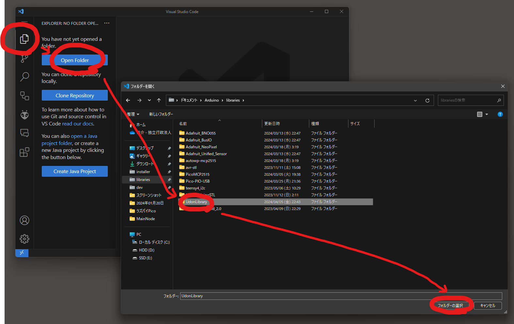
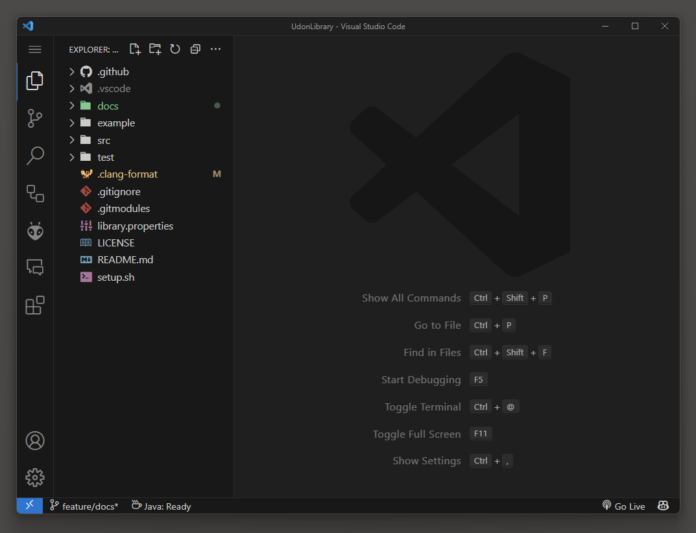
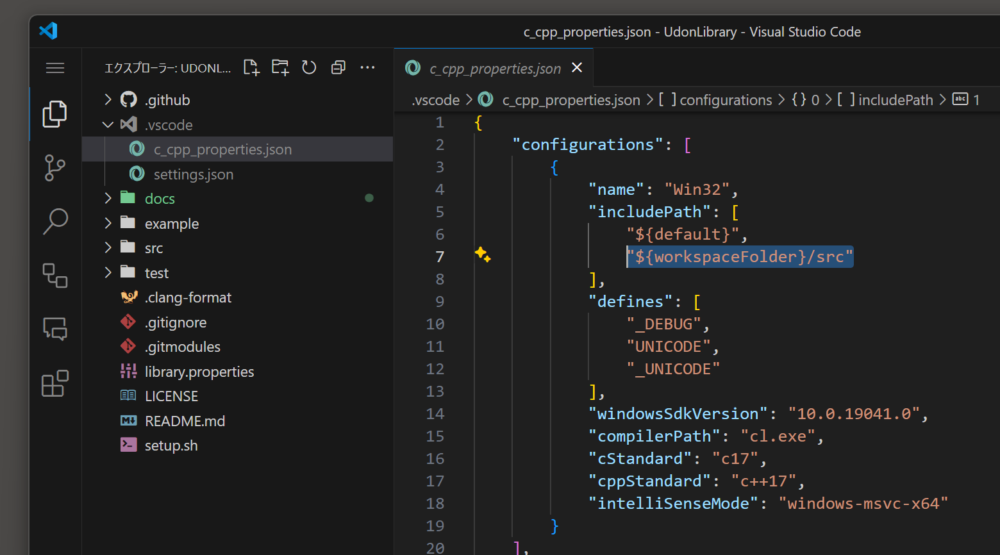
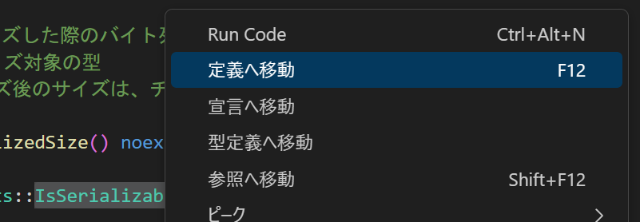
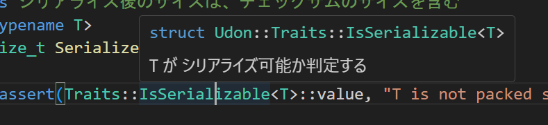
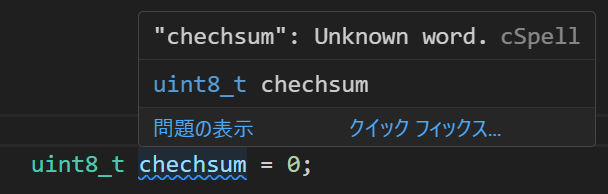
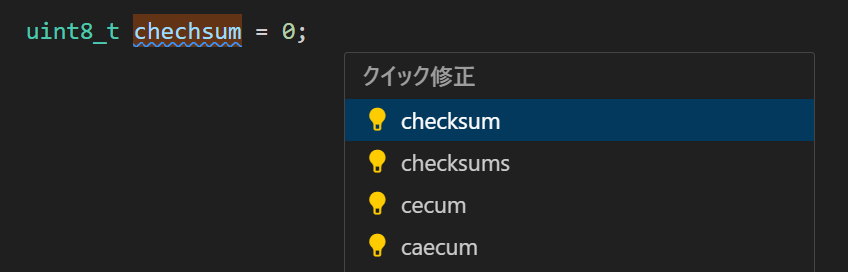
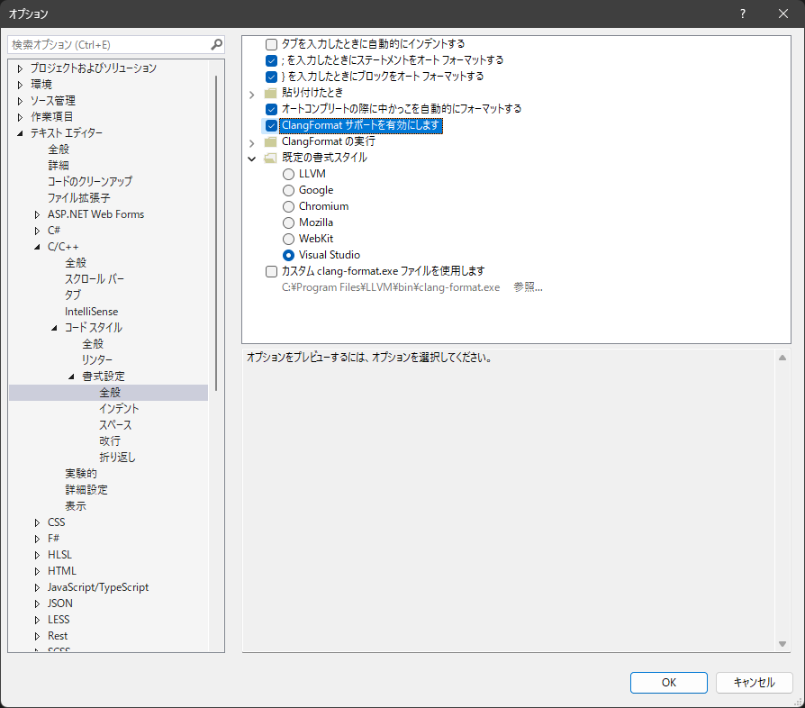
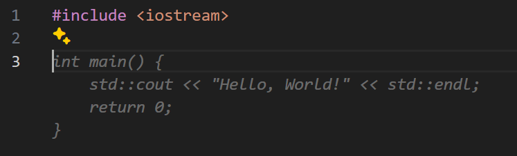

# 開発環境セットアップ

## 開発環境

開発環境は自由ですが、ここでは VSCode, VisualStudio, ArduinoIDE を使用します。インストールしていない場合インストールしておいてください。

本ライブラリのクローンを事前に行っておいてください。[ライブラリのクローン](../Install/ArduinoIDE.md)

> 通常の開発では VSCode で記述 -> ArduinoIDE でコンパイル, 書き込み を繰り返し行います。
>
> マイコンを使用しないアルゴリズム系の開発の場合、デバッグのしやすい VisualStudio が便利です。最終的に ArduinoIDE でコンパイルできるか確認します。

## VSCode

### ライブラリを開く

通常 VSCode で本ライブラリを編集します。以下の写真の手順で VSCode でフォルダを開きます。



開けるとこのようになります。左に表示されるエクスプローラーからファイルを開けるので、そこから編集していきます。



### clang-format 拡張機能インストール

clang-format とはフォーマッタの一種で、コードを自動整形してくれるツールです。 clang-format は整形の設定を詳細に行えるので、本ライブラリで採用しています。設定ファイルは `UdonLibrary/.clang-format` にあります。コンパイラ基盤 LLVM が開発しています。

[Clang-Format](https://marketplace.visualstudio.com/items?itemName=xaver.clang-format)

設定ができたら自動整形が機能するか、適当にファイルを作成してテストしてみましょう。デフォルトでは `Alt` + `Shift` + `F` で整形できます。

```cpp
// 整形前
void loop(){
int a = 100;
double b = 100.0;
}
```

```cpp
// 整形後
void loop()
{
    int a = 100;
    double b = 100.0;
}
```

### C/C++ 拡張機能インストール

この拡張機能はインテリセンスの機能を持ちます。定義先に移動したり、関数名などをホバーすることで記載されている doxygen コメントを表示させたりできます。

[C/C++](https://marketplace.visualstudio.com/items?itemName=ms-vscode.cpptools)

定義先に移動するには、c_cpp_properties.json に本ライブラリのインクルードパスを教えてあげる必要があります。

```json
"${workspaceFolder}/src"
```


↓ `f12` で関数、クラス定義先へ移動できます。



↓ 関数、クラス名をホバーすることで、doxygen コメントが表示されます。



### スペルチェッカー拡張機能インストール

英単語のスペルミスを検出してくれるツールです。ミスがある場合、修正の提案もしてくれます。スペルチェッカーが知らない単語は辞書に追加することで対応できます。スペルミスは恥ずかしいですから、是非入れましょう!

[Code Spell Checker](https://marketplace.visualstudio.com/items?itemName=streetsidesoftware.code-spell-checker)

↓ スペルミス検出の様子



↓ 修正の提案



## Visual Studio

### ライブラリを開く

Visual Studio でライブラリを開くことはありません。VSCode で編集、Visual Studio からインクルードし、ビルドの流れで開発します。Visual Studio でライブラリ内のファイルに移動し編集をすることはあります。

### clang-format

ツールタブからオプション選択しダイアログを開きます。以下の写真に示すように ClangFormat サポートの有効化にチェックを入れるだけ！

`Ctrl` + `K` → `Ctrl` + `D` で整形できます。



## GitHub Copilot 導入

GitHub Copilot とは AI がソースコードを提案してくれる便利な開発支援ツールです。使用方法によりますが、このツールを導入すると開発速度が数倍アップします。

有料ですが、学生は申請を行うことで無料で使用できるので、申請することをお勧めします。なくても開発は可能です。GitHub Copilot は GitHub Student Developer Pack に付属している GitHub Global Campus に入ると使用できるようになります。GitHub Student Developer Pack は他にも有用な有料ツールを無料で使用できるようになる特権があるため、こちらに申請することをお勧めします。[申請ページ](https://education.github.com/)

[VSCode へのインストール手順](https://docs.github.com/ja/copilot/using-github-copilot/getting-started-with-github-copilot#visual-studio-code-%E3%81%A7-github-copilot-%E6%8B%A1%E5%BC%B5%E6%A9%9F%E8%83%BD%E3%82%92%E3%82%A4%E3%83%B3%E3%82%B9%E3%83%88%E3%83%BC%E3%83%AB%E3%81%99%E3%82%8B)

[Visual Studio へのインストール手順](https://learn.microsoft.com/ja-jp/visualstudio/ide/visual-studio-github-copilot-extension?view=vs-2022#install-using-the-visual-studio-installer)

↓ GitHub Copilot による自動補完の様子 (灰色文字)


