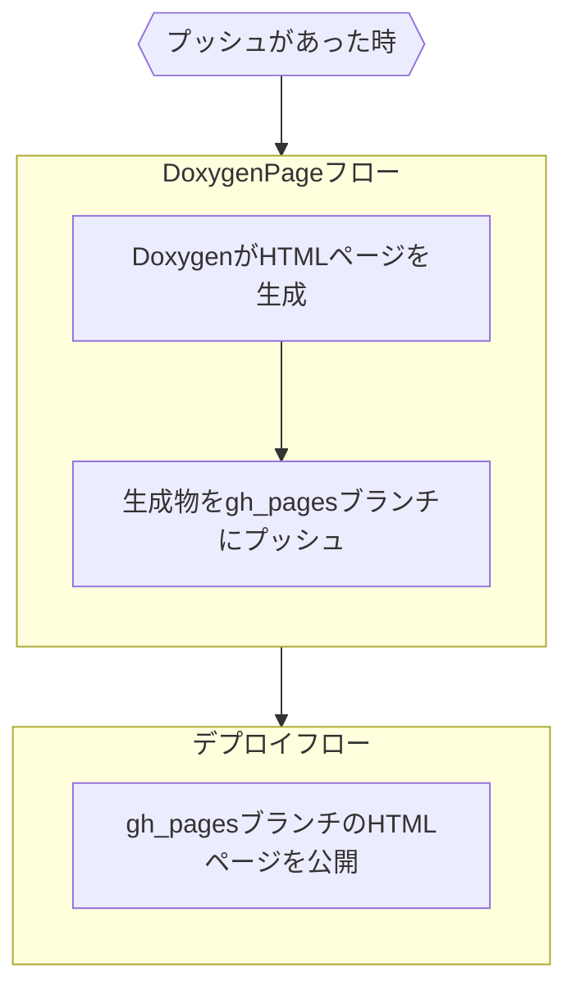

# ドキュメント自動生成

Doxygen を用いてソースコード、マークダウンからドキュメントを自動生成しています。マスターブランチにプッシュがあった場合 GitHub Actions を通じてページが更新されます。ワークフローは `.github/workflows/DoxygenPage.yml` に定義されており、以下の流れで更新を行います。



## ローカル環境で実行

1. Doxygen をインストール

   <https://www.doxygen.nl/download.html#latestsrc>

   Doxygen コマンドが使用できるようパスを通す必要があります。

2. UdonLibrary ディレクトリで Doxygen を実行

   ```sh
   doxygen Doxyfile
   ```

3. ページ が ./docs/DoxygenDist/html に生成されるのでブラウザで開く

   ```sh
   start ./docs/DoxygenDist/html/index.html
   ```

   > 生成物は git に追跡されません。