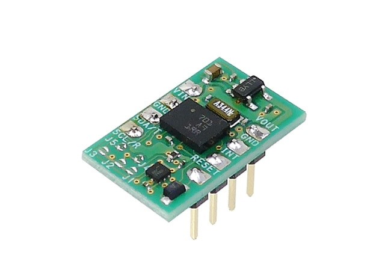

# BNO055



9 軸ジャイロセンサー

`BNO055` クラスを使用します。コンストラクタには、センサーと接続されているマイコン側 I2C 端子に対応する TwoWire オブジェクトを指定します。

下にジャイロセンサのヨー角を取得する例を示します。ロボットにセンサーを水平に設置した場合、ロボットの旋回角はヨー角となります。

I2C のアドレス 0x28 を使用します。他にセンサを接続している場合注意してください。

```cpp
#include <Udon.hpp>

Udon::BNO055 gyro{ Wire };

void setup()
{
    gyro.begin();
}

void loop()
{
    gyro.update();

    const double yaw = gyro.getQuaternion().toYaw();
}
```

> オイラー角からヨー角を取得することもできますが、ヨー角のみを取得する場合、クオータニオンからヨー角を求める方がパフォーマンス的に良いです。(内部的にクオータニオンを用いており、オイラー角に変換する段階で不要なピッチ、ロール角まで求めてしまうため)
>
> ```cpp
> const double yaw = gyro.getEuler().yaw;
> ```
