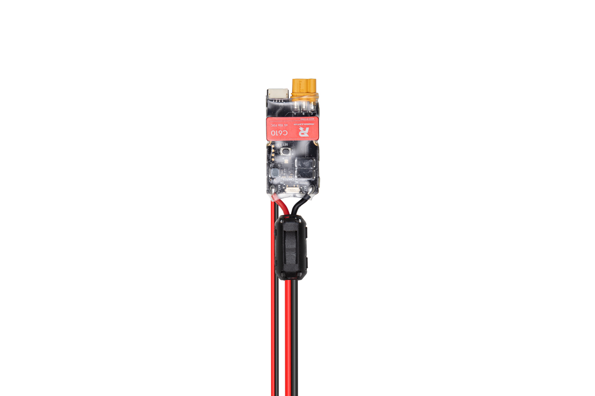
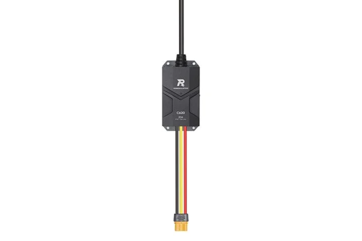

# ロボマスモーター

ロボマスモーターは CAN 通信経由で制御できるモーターです。電流値を指定することで動作し、またエンコーダーを搭載しているため、回転数や回転角を取得できます。

## 個別インクルード

```cpp
#include <Udon/Driver/RoboMasterMotor.hpp>
```

## 概要

以下の表に示すように、使用するドライバによってクラスが異なります。また指定できる電流範囲も異なります。

使用される CAN ID は `0x200`, `0x1FF`, `0x200+モーターID` です。ドライバは 1ms 間隔で CAN フレームを送信するため、ドライバが接続されている CAN バスには、他の CAN デバイスを接続しないことをお勧めします。

|               |                    C610 ドライバ                     |                    C620 ドライバ                     |
| :-----------: | :--------------------------------------------------: | :--------------------------------------------------: |
|   イメージ    |  |  |
|    クラス     |                   `RoboMasterC610`                   |                   `RoboMasterC620`                   |
| 電流範囲 (mA) |                   10,000 ~ -10,000                   |                   20,000 ~ -20,000                   |

## 電流値の指定

`setCurrent` で電流値を指定することで動作します。電流範囲は先ほどの表のとおりです。

```cpp
#include <Udon.hpp>

static Udon::CanBusTeensy<CAN1> bus;

static Udon::RoboMasterXXXX motor{ bus, 1 };   // ロボマスモーター (モーターID: 1)

void setup()
{
    bus.begin();
}

void loop()
{
    bus.update();

    // 動作電流値を設定 (mA)
    motor.setCurrent(10000);
}
```

## センサー値取得

回転角度、回転速度、トルク電流、モーター温度を取得可能です。位置制御や速度制御をする場合、フィードバック制御と組み合わせて使用してください。

ドライバは駆動電源で動作するため、駆動電源が切れるとドライバに保存されているエンコーダー角が消去される点に注意してください。

```cpp
void loop()
{
    // 回転角度 [rad]
    const double angle = motor.getAngle();

    // 回転速度 [rpm]
    const int16_t rpm = motor.getVelocity();

    // トルク電流 [mA]
    const int16_t torqueCurrent = motor.getTorqueCurrent();

    // モーターの温度 [℃]
    const uint8_t temp = motor.getTemperature();
}
```

## 複数モーター

モーター ID ごとにオブジェクトを生成することで、1 つの CAN バスに対して最大 8 つまでモーターを接続可能です。

モーター ID はドライバについている SET ボタンを押した後、加えて ID 番号回ボタンを押すことで設定できます。モーター ID は緑に点滅する LED の点滅回数で確認できます。

```cpp
#include <Udon.hpp>

static Udon::CanBusTeensy<CAN1> bus;

static Udon::RoboMasterC620 motor1{ bus, 1 };
static Udon::RoboMasterC620 motor2{ bus, 2 };
static Udon::RoboMasterC610 motor3{ bus, 3 };
static Udon::RoboMasterC610 motor4{ bus, 4 };
```
