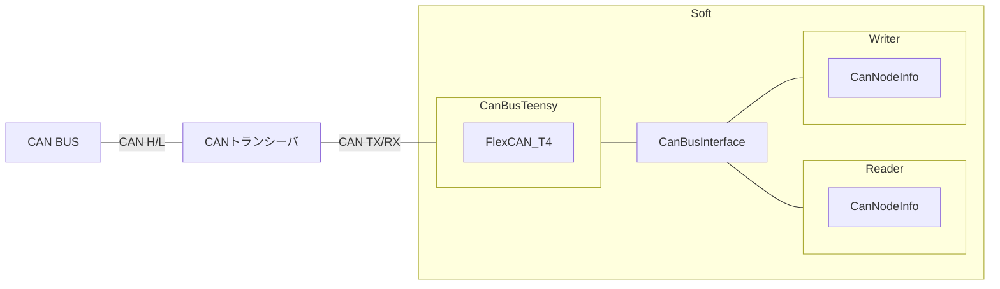
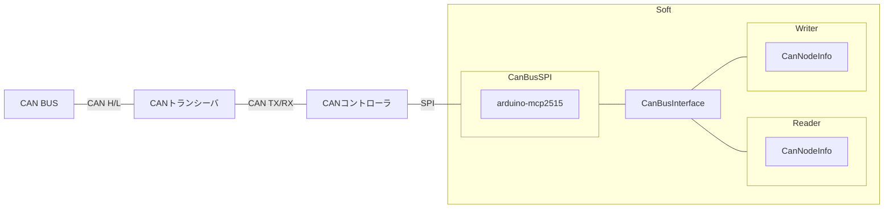

# CAN Bus

バス管理クラス

## Common

<details>
<summary>CanNodeInfo</summary>

各ノードを管理する構造体です。以下のメンバを持ちます。

```cpp
uint32_t id
uint8_t* buffer
size_t   length
uint32_t timestampUs
```

`id` : 自身の ID もしくは監視する ID

`buffer` : 送信、受信バッファをさすポインタ

`length` : 送信、受信バッファ長

`timestampUs` : 最後に送信、受信バッファにアクセスした時間[μs]

</details>

<details>
<summary>CanBusInterface</summary>

バス管理クラスを一律に使用できるようにするインターフェースクラスです。

バス管理クラスは全てこのクラスを継承し、純粋仮想関数をオーバーライドしています。

この継承関係によって、使用するマイコンによってバス管理クラス(型)が切り替わっても、一律にバスオブジェクトの参照、ポインタを持つことができます。

-   API

    ノードをバスに参加させる

    -   `virtual joinTX(CanNodeInfo& node)`
    -   `virtual joinRX(CanNodeInfo& node)`

    ノードをバスから切り離す

    -   `virtual detachTX(CanNodeInfo& node)`
    -   `virtual detachRX(CanNodeInfo& node)`

-   Sample

    ```cpp
    uint8_t buffer[10];
    CanNodeInfo node {
        /*uint32_t id         */ 0            ,
        /*uint8_t* buffer     */ buffer       ,
        /*size_t   length     */ sizeof buffer,
        /*uint32_t timestampUs*/ 0            ,
    };

    CanBus---- bus;

    void setup() {
        bus.joinTX(node);
    }
    void loop() {}
    ```

    ```cpp
    /// @brief 可変長データを送受信する CanNodeInfo ラッパークラス
    class CanWriterVLA
    {
        // 全バス管理クラスがCANBusInterfaceを継承しているので、このように全バス管理クラスの参照を保持できます。
        CanBusInterface& bus ;
        CanNodeInfo      info;
    public:
        CanWriterVLA(CanBusInterface& bus, uint32_t id)
            : bus(bus)
            , info(
                /*uint32_t id         */ id     ,
                /*uint8_t* buffer     */ nullptr,
                /*size_t   length     */ 0      ,
                /*uint32_t timestampUs*/ 0      ,
              )
        {
            bus.joinTX(info);
        }
        ~CanWriterVLA()
        {
            bus.detachTX(info);
            delete[] info.buffer;
        }
        void resize(size_t n)
        {
            delete[] info.buffer;

            // バス管理クラスは CanNodeInfo インスタンスのポインタを内部に保持しています。
            // そのため CanNodeInfo インスタンスを書き換えると、バス管理クラスにも書き換えが反映されます。
            info.buffer = new uint8_t[n]();
            info.length = n;
        }
    };

    CanBusTeensy<CAN1> bus;

    CanWriterVLA writer(bus, 0);
    ```

</details>

## Bus Class

<details>
<summary>CanBusTeensy</summary>

teensy 内臓 CAN コントローラーを使用して、 CAN 通信を行うバス管理クラス



-   依存ライブラリ

    [FlexCAN_T4](https://github.com/tonton81/FlexCAN_T4)

    [IntervalTimer](https://github.com/loglow/IntervalTimer)

-   API

    コンストラクタ

    -   `template<CAN_DEV_TABLE Bus> CanBusTeensy::CanBusTeensy()`

        `@tparam {Bus}` バス種類 (CAN0,CAN1,CAN2,CAN3) [ライブラリドキュメント](https://github.com/tonton81/FlexCAN_T4) 参照

    通信開始

    -   `void CanBusTeensy::begin(uint32_t baudrate = 1000000)`

        `@param {baudrate}` CAN 通信レート

    通信更新

    -   `void CanBusTeensy::update(uint32_t writeIntervalUs = 5000)`

        `@param {writeIntervalUs}` 送信間隔

        バスに大量のデータが流れないよう、ループ周期に関係なく設定間隔以下で送信されないようになっています。

-   メモリ

    CanNodeInfo のインスタンスを指すポインタをリストとしてヒープ領域に保持します。

-   Sample

    ノード ID0 が送信しているデータを取得する。

    ```cpp
    uint8_t buffer[10];
    CanNodeInfo node {
        /*uint32_t id         */ 0            ,
        /*uint8_t* buffer     */ buffer       ,
        /*size_t   length     */ sizeof buffer,
        /*uint32_t timestampUs*/ 0            ,
    };

    CanBusTeensy<CAN1> bus;
    void setup()
    {
        bus.joinRX(node);  // ノードをバスに参加させる(複数参加させることもできます)
        bus.begin();       // 通信開始
        Serial.begin(115200);
    }

    void loop()
    {
        bus.update();
        for(size_t i = 0; i < node.length; ++i)
        {
            Serial.print(node.buffer[i]);
        }
        Serial.println();
    }
    ```

    生で `CanNodeInfo` を使うと少し複雑になります。そのため `CanNodeInfo` のラッパークラスである、`CanReader`, `CanWriter` クラス等を使います。ラッパークラス

-   開発者

    大河祐介

</details>

<details>
<summary>CanBusSPI</summary>
外付け CAN コントローラーを使用して CAN 通信を行うバス管理クラス



-   依存ライブラリ

    [arduino-mcp2515](https://github.com/autowp/arduino-mcp2515)

-   API

    コンストラクタ

    -   `template<uint8_t CS, uint8_t Interrupt> CanBusSPI::CanBusSPI(SPIClass& SPI, uint32_t SPIClock = 10000000)`

        `@tparam {CS}` SPI chip select ピン

        `@tparam {Interrupt}` CAN コントローラー Int 端子接続ピン

        `@param {SPI}` SPI クラスインスタンス

        `@param {SPIClock}` SPI クロック

    通信開始

    -   `void CanBusSPI::begin(CAN_CLOCK CANClock = MCP_20MHZ, CAN_SPEED baudrate = CAN_1000KBPS)`

        `@param {baudrate}` CAN 通信レート [ライブラリドキュメント](https://github.com/autowp/arduino-mcp2515) 参照

        `@param {CANClock}` CAN コントローラー動作周波数 [ライブラリドキュメント](https://github.com/autowp/arduino-mcp2515) 参照

    通信更新

    -   `void CanBusTeensy::update(uint32_t writeIntervalUs = 5000)`

        `@param {writeIntervalUs}` 送信間隔

        バスに大量のデータが流れないよう、ループ周期に関係なく設定間隔以下で送信されないようになっています。

        つまりこの関数を呼ぶことによって、送信処理が行われるかは呼び出すタイミング次第です。

-   Sample

    ```cpp
    CanBusSPI<9, 2> bus(SPI);
    void setup() {
        bus.begin();
    }
    void loop() {
        bus.update();
    }
    ```

-   開発者

    大河祐介

</details>

<details>
<summary>バス管理クラス開発について</summary>

今後マイコンが変わった際など、バス管理クラスを新たに作成することがあるかと思います。開発待ってます！！

-   留意点

    `CanBusInterface` クラスを継承し、純粋仮想関数をオーバーライドしてください。

    `CanNodeInfo` のラッパークラスは、バス管理クラスが`CanBusInterface` クラスを継承している前提で作られていますす。

    バス管理クラスごとにファイル分割して、`Can.hpp` からインクルードしてください。

    プリプロセッサーディレクティブ(#if, #endif等)を使って、特定のマイコンの場合にバス管理クラスが有効になるようにしてください。

    ```cpp
    #if defined(__MK20DX256__) || defined(__MK64FX512__) ...
    class CanBus--- {
    };
    #endif
    ```

</details>
